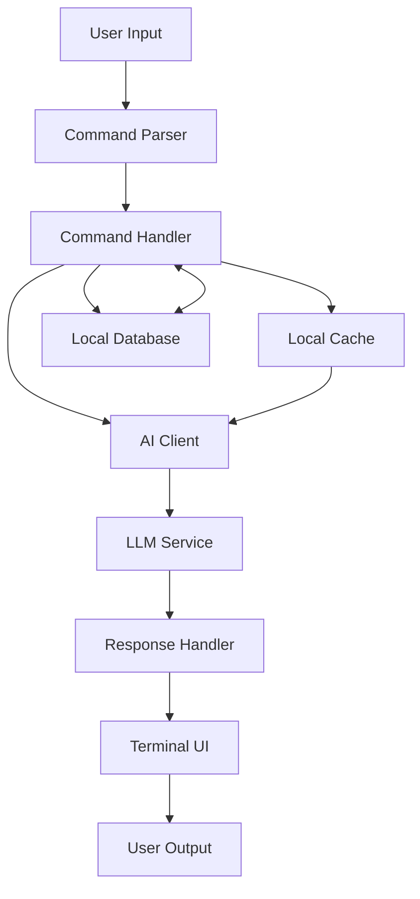

# AI Integration Guide for CLI Applications 2025

> Comprehensive guide for building AI-enhanced command line applications using modern tooling and design patterns

## Table of Contents
- [Architecture Overview](#architecture-overview)
- [AI Integration Patterns](#ai-integration-patterns)
- [State Management](#state-management)
- [Data Flow Design](#data-flow-design)
- [Prompt Engineering](#prompt-engineering)
- [UI/UX Patterns](#uiux-patterns)
- [Performance Optimization](#performance-optimization)
- [Design Patterns](#design-patterns)
- [Best Practices](#best-practices)

## Architecture Overview

### Core Components

- **LLM Integration**: Direct API access to language models
- **CLI Framework**: Command structure and argument parsing
- **TUI Framework**: Terminal user interface components and layouts
- **Local State**: In-memory state management for interactive sessions
- **Persistent Storage**: Configuration and data storage
- **AI Cache**: Response caching and embedding storage

### System Design



### Recommended Stack

- **CLI Framework**: Go (using [Cobra](https://github.com/spf13/cobra)) or Rust ([clap](https://github.com/clap-rs/clap))
- **TUI Components**: [Charm](https://charm.sh/) ecosystem (BubbleTea, Lip Gloss, etc.)
- **AI Providers**: OpenAI, Anthropic, local models via [Ollama](https://ollama.ai/)
- **Local Database**: SQLite, [Skate](https://github.com/charmbracelet/skate) for key-value
- **Vector Store**: SQLite with vector extensions or [Chroma](https://www.trychroma.com/) for embedding storage

## AI Integration Patterns

### Direct LLM Integration

```go
// ai/client.go
package ai

import (
	"context"
	"github.com/sashabaranov/go-openai"
)

type Client struct {
	openAI *openai.Client
	config Config
}

type Config struct {
	Model       string
	Temperature float32
	MaxTokens   int
}

func NewClient(apiKey string, config Config) *Client {
	return &Client{
		openAI: openai.NewClient(apiKey),
		config: config,
	}
}

func (c *Client) Complete(ctx context.Context, prompt string) (string, error) {
	resp, err := c.openAI.CreateChatCompletion(
		ctx,
		openai.ChatCompletionRequest{
			Model: c.config.Model,
			Messages: []openai.ChatCompletionMessage{
				{
					Role:    openai.ChatMessageRoleUser,
					Content: prompt,
				},
			},
			Temperature: c.config.Temperature,
			MaxTokens:   c.config.MaxTokens,
		},
	)

	if err != nil {
		return "", err
	}

	return resp.Choices[0].Message.Content, nil
}
```

### Streaming Responses

```go
// ai/streaming.go
package ai

import (
	"context"
	"github.com/sashabaranov/go-openai"
	"io"
)

func (c *Client) StreamComplete(
	ctx context.Context, 
	prompt string, 
	writer io.Writer,
) error {
	stream, err := c.openAI.CreateChatCompletionStream(
		ctx,
		openai.ChatCompletionRequest{
			Model: c.config.Model,
			Messages: []openai.ChatCompletionMessage{
				{
					Role:    openai.ChatMessageRoleUser,
					Content: prompt,
				},
			},
			Temperature: c.config.Temperature,
			MaxTokens:   c.config.MaxTokens,
			Stream:      true,
		},
	)
	
	if err != nil {
		return err
	}
	defer stream.Close()

	for {
		response, err := stream.Recv()
		if err == io.EOF {
			break
		}
		if err != nil {
			return err
		}
		
		_, err = writer.Write([]byte(response.Choices[0].Delta.Content))
		if err != nil {
			return err
		}
	}
	
	return nil
}
```

### Integrating with Bubble Tea

```go
// ui/model.go
package ui

import (
	"context"
	"github.com/charmbracelet/bubbles/spinner"
	"github.com/charmbracelet/bubbles/textarea"
	"github.com/charmbracelet/bubbles/viewport"
	tea "github.com/charmbracelet/bubbletea"
	"github.com/charmbracelet/lipgloss"
	"github.com/your-app/ai"
)

type Model struct {
	viewport    viewport.Model
	textarea    textarea.Model
	spinner     spinner.Model
	aiClient    *ai.Client
	response    string
	err         error
	loading     bool
	width       int
	height      int
}

type completionMsg string
type errorMsg error

func InitialModel(aiClient *ai.Client) Model {
	ta := textarea.New()
	ta.Placeholder = "Ask something..."
	ta.Focus()

	vp := viewport.New(0, 0)
	
	s := spinner.New()
	s.Spinner = spinner.Dot
	
	return Model{
		viewport: vp,
		textarea: ta,
		spinner:  s,
		aiClient: aiClient,
		loading:  false,
	}
}

func (m Model) Init() tea.Cmd {
	return tea.Batch(
		textarea.Blink,
		spinner.Tick,
	)
}

func (m Model) Update(msg tea.Msg) (tea.Model, tea.Cmd) {
	var (
		tiCmd tea.Cmd
		vpCmd tea.Cmd
		spCmd tea.Cmd
	)

	switch msg := msg.(type) {
	case tea.KeyMsg:
		switch msg.String() {
		case "ctrl+c", "esc":
			return m, tea.Quit
		case "ctrl+enter":
			if !m.loading && m.textarea.Value() != "" {
				m.loading = true
				prompt := m.textarea.Value()
				return m, generateCompletion(m.aiClient, prompt)
			}
		}
	
	case tea.WindowSizeMsg:
		m.width = msg.Width
		m.height = msg.Height
		m.viewport.Width = msg.Width
		m.viewport.Height = msg.Height - 6 // Leave room for input
		
	case completionMsg:
		m.loading = false
		m.response = string(msg)
		m.viewport.SetContent(m.response)
		
	case errorMsg:
		m.loading = false
		m.err = msg
		
	case spinner.TickMsg:
		if m.loading {
			m.spinner, spCmd = m.spinner.Update(msg)
		}
	}

	m.textarea, tiCmd = m.textarea.Update(msg)
	m.viewport, vpCmd = m.viewport.Update(msg)

	return m, tea.Batch(tiCmd, vpCmd, spCmd)
}

func (m Model) View() string {
	if m.loading {
		return lipgloss.JoinVertical(lipgloss.Left,
			m.viewport.View(),
			m.spinner.View() + " Thinking...",
			m.textarea.View(),
		)
	}
	
	return lipgloss.JoinVertical(lipgloss.Left,
		m.viewport.View(),
		m.textarea.View(),
	)
}

func generateCompletion(client *ai.Client, prompt string) tea.Cmd {
	return func() tea.Msg {
		resp, err := client.Complete(context.Background(), prompt)
		if err != nil {
			return errorMsg(err)
		}
		return completionMsg(resp)
	}
}
```

## State Management

### Configuration Management with Viper

```go
// config/config.go
package config

import (
	"os"
	"path/filepath"
	
	"github.com/spf13/viper"
)

type Config struct {
	OpenAI struct {
		APIKey      string
		Model       string
		Temperature float32
		MaxTokens   int
	}
	
	LocalCache struct {
		Enabled bool
		Path    string
		MaxSize int64
	}
	
	VectorDB struct {
		Enabled  bool
		Path     string
		Dimension int
	}
}

func LoadConfig() (*Config, error) {
	configHome, err := os.UserConfigDir()
	if err != nil {
		return nil, err
	}
	
	configPath := filepath.Join(configHome, "your-app")
	if err := os.MkdirAll(configPath, 0755); err != nil {
		return nil, err
	}
	
	viper.SetConfigName("config")
	viper.SetConfigType("yaml")
	viper.AddConfigPath(configPath)
	
	// Set defaults
	viper.SetDefault("OpenAI.Model", "gpt-4")
	viper.SetDefault("OpenAI.Temperature", 0.7)
	viper.SetDefault("OpenAI.MaxTokens", 2000)
	viper.SetDefault("LocalCache.Enabled", true)
	viper.SetDefault("LocalCache.Path", filepath.Join(configPath, "cache"))
	viper.SetDefault("LocalCache.MaxSize", 1024*1024*100) // 100MB
	viper.SetDefault("VectorDB.Enabled", false)
	viper.SetDefault("VectorDB.Path", filepath.Join(configPath, "vectordb"))
	viper.SetDefault("VectorDB.Dimension", 1536)
	
	if err := viper.ReadInConfig(); err != nil {
		if _, ok := err.(viper.ConfigFileNotFoundError); ok {
			// Config file not found, create one with defaults
			if err := viper.SafeWriteConfig(); err != nil {
				return nil, err
			}
		} else {
			return nil, err
		}
	}
	
	// Try to get API key from env var if not in config
	if viper.GetString("OpenAI.APIKey") == "" {
		viper.Set("OpenAI.APIKey", os.Getenv("OPENAI_API_KEY"))
	}
	
	var config Config
	if err := viper.Unmarshal(&config); err != nil {
		return nil, err
	}
	
	return &config, nil
}
```

### Chat History Management

```go
// db/chat.go
package db

import (
	"database/sql"
	"time"
	
	_ "github.com/mattn/go-sqlite3"
)

type Chat struct {
	ID        int64
	Title     string
	CreatedAt time.Time
	UpdatedAt time.Time
}

type Message struct {
	ID        int64
	ChatID    int64
	Role      string
	Content   string
	CreatedAt time.Time
}

type ChatStore struct {
	db *sql.DB
}

func NewChatStore(dbPath string) (*ChatStore, error) {
	db, err := sql.Open("sqlite3", dbPath)
	if err != nil {
		return nil, err
	}
	
	if err := createTables(db); err != nil {
		return nil, err
	}
	
	return &ChatStore{db: db}, nil
}

func createTables(db *sql.DB) error {
	_, err := db.Exec(`
		CREATE TABLE IF NOT EXISTS chats (
			id INTEGER PRIMARY KEY,
			title TEXT NOT NULL,
			created_at TIMESTAMP NOT NULL,
			updated_at TIMESTAMP NOT NULL
		);
		
		CREATE TABLE IF NOT EXISTS messages (
			id INTEGER PRIMARY KEY,
			chat_id INTEGER NOT NULL,
			role TEXT NOT NULL,
			content TEXT NOT NULL,
			created_at TIMESTAMP NOT NULL,
			FOREIGN KEY (chat_id) REFERENCES chats (id) ON DELETE CASCADE
		);
	`)
	
	return err
}
```

## Data Flow Design

### Using Skate for Key-Value Storage

```go
// storage/skate.go
package storage

import (
	"context"
	"time"
	
	"github.com/charmbracelet/skate"
)

type SkateStore struct {
	client *skate.Client
}

func NewSkateStore() (*SkateStore, error) {
	client, err := skate.NewClient()
	if err != nil {
		return nil, err
	}
	
	return &SkateStore{
		client: client,
	}, nil
}

func (s *SkateStore) Set(key string, value []byte) error {
	ctx, cancel := context.WithTimeout(context.Background(), 5*time.Second)
	defer cancel()
	
	_, err := s.client.Set(ctx, key, value, nil)
	return err
}

func (s *SkateStore) Get(key string) ([]byte, error) {
	ctx, cancel := context.WithTimeout(context.Background(), 5*time.Second)
	defer cancel()
	
	val, _, err := s.client.Get(ctx, key)
	return val, err
}
```

## Prompt Engineering

### System Prompts for CLI Tools

```go
// ai/prompts.go
package ai

import (
	"fmt"
	"strings"
)

// SystemPromptTemplate is a template for system prompts
const SystemPromptTemplate = `You are %s, a command-line AI assistant that helps users with %s.
Your responses should be concise, focused, and formatted appropriately for terminal display.
%s
Current date: %s
Current directory: %s
%s`

// NewSystemPrompt creates a system prompt based on the template
func NewSystemPrompt(
	assistantName string,
	primaryFunction string,
	additionalContext string,
	currentDate string,
	currentDir string,
	outputFormat string,
) string {
	return fmt.Sprintf(
		SystemPromptTemplate,
		assistantName,
		primaryFunction,
		additionalContext,
		currentDate,
		currentDir,
		outputFormat,
	)
}

// FunctionPromptTemplate is a template for function calling
const FunctionPromptTemplate = `To execute commands, use the following JSON format:
{
  "command": "command_name",
  "args": {
    "arg1": "value1",
    "arg2": "value2"
  }
}

Available commands:
%s

Respond with valid JSON only when a command needs to be executed.
Otherwise, respond with plain text.`

// NewFunctionPrompt creates a function prompt with available commands
func NewFunctionPrompt(availableCommands []string) string {
	var commandDescriptions []string
	for _, cmd := range availableCommands {
		commandDescriptions = append(commandDescriptions, fmt.Sprintf("- %s", cmd))
	}
	
	return fmt.Sprintf(FunctionPromptTemplate, strings.Join(commandDescriptions, "\n"))
}
```

## UI/UX Patterns

### Charm-based UI Components

```go
// ui/components.go
package ui

import (
	"github.com/charmbracelet/bubbles/list"
	"github.com/charmbracelet/bubbles/progress"
	"github.com/charmbracelet/bubbles/textinput"
	"github.com/charmbracelet/lipgloss"
)

var (
	titleStyle = lipgloss.NewStyle().
		Bold(true).
		Foreground(lipgloss.Color("#FAFAFA")).
		Background(lipgloss.Color("#7D56F4")).
		Padding(0, 1).
		MarginBottom(1)
	
	infoStyle = lipgloss.NewStyle().
		Foreground(lipgloss.Color("#FAFAFA")).
		Italic(true)
	
	errorStyle = lipgloss.NewStyle().
		Foreground(lipgloss.Color("#FF0000")).
		Bold(true)
	
	successStyle = lipgloss.NewStyle().
		Foreground(lipgloss.Color("#00FF00"))
	
	promptStyle = lipgloss.NewStyle().
		Foreground(lipgloss.Color("#7D56F4")).
		Bold(true)
)

// NewPromptInput creates a text input for user prompts
func NewPromptInput() textinput.Model {
	ti := textinput.New()
	ti.Placeholder = "Enter your question..."
	ti.PromptStyle = promptStyle
	ti.TextStyle = lipgloss.NewStyle().Foreground(lipgloss.Color("#FFFFFF"))
	ti.Focus()
	
	return ti
}

// NewModelList creates a list of available models
func NewModelList(models []string) list.Model {
	items := make([]list.Item, len(models))
	for i, model := range models {
		items[i] = item{title: model, desc: ""}
	}
	
	li := list.New(items, list.NewDefaultDelegate(), 0, 0)
	li.Title = "Available Models"
	li.SetShowStatusBar(false)
	li.SetFilteringEnabled(false)
	
	return li
}

// Custom item implementation for list
type item struct {
	title string
	desc  string
}

func (i item) Title() string       { return i.title }
func (i item) Description() string { return i.desc }
func (i item) FilterValue() string { return i.title }
```

### AI Response Rendering with Glamour

```go
// ui/render.go
package ui

import (
	"github.com/charmbracelet/glamour"
	"github.com/charmbracelet/lipgloss"
)

var (
	renderer *glamour.TermRenderer
	
	codeBlockStyle = lipgloss.NewStyle().
		BorderStyle(lipgloss.RoundedBorder()).
		BorderForeground(lipgloss.Color("#7D56F4")).
		Padding(0, 1)
)

func init() {
	var err error
	renderer, err = glamour.NewTermRenderer(
		glamour.WithAutoStyle(),
		glamour.WithEmoji(),
		glamour.WithWordWrap(80),
	)
	if err != nil {
		panic(err)
	}
}

// RenderMarkdown renders markdown with syntax highlighting
func RenderMarkdown(markdown string) (string, error) {
	return renderer.Render(markdown)
}

// RenderCodeBlock renders a code block with syntax highlighting
func RenderCodeBlock(code string, language string) string {
	return codeBlockStyle.Render("```" + language + "\n" + code + "\n```")
}
```

### Interactive Forms with Huh

```go
// ui/forms.go
package ui

import (
	"github.com/charmbracelet/huh"
)

// ConfigForm creates a form for configuring the application
func ConfigForm(config *Config) (*huh.Form, error) {
	var (
		apiKey      = config.OpenAI.APIKey
		model       = config.OpenAI.Model
		temperature = config.OpenAI.Temperature
		maxTokens   = config.OpenAI.MaxTokens
		cacheEnabled = config.LocalCache.Enabled
	)
	
	form := huh.NewForm(
		huh.NewGroup(
			huh.NewInput().
				Title("OpenAI API Key").
				Value(&apiKey).
				Password(true),
			huh.NewSelect[string]().
				Title("Model").
				Options(
					huh.NewOption("GPT-4", "gpt-4"),
					huh.NewOption("GPT-4 Turbo", "gpt-4-turbo-preview"),
					huh.NewOption("GPT-3.5 Turbo", "gpt-3.5-turbo"),
				).
				Value(&model),
			huh.NewSlider().
				Title("Temperature").
				Min(0).
				Max(2).
				Step(0.1).
				Value(&temperature),
			huh.NewInput().
				Title("Max Tokens").
				Value(&maxTokens),
			huh.NewConfirm().
				Title("Enable local caching?").
				Value(&cacheEnabled),
		),
	)
	
	return form, nil
}
```

## Performance Optimization

### Response Caching

```go
// cache/cache.go
package cache

import (
	"crypto/sha256"
	"encoding/hex"
	"os"
	"path/filepath"
	"time"
)

type Cache struct {
	basePath string
	maxAge   time.Duration
}

func NewCache(basePath string, maxAge time.Duration) (*Cache, error) {
	if err := os.MkdirAll(basePath, 0755); err != nil {
		return nil, err
	}
	
	return &Cache{
		basePath: basePath,
		maxAge:   maxAge,
	}, nil
}

func (c *Cache) Get(key string) ([]byte, bool) {
	path := c.keyToPath(key)
	
	info, err := os.Stat(path)
	if os.IsNotExist(err) {
		return nil, false
	}
	if err != nil {
		return nil, false
	}
	
	// Check if cache entry is expired
	if time.Since(info.ModTime()) > c.maxAge {
		os.Remove(path)
		return nil, false
	}
	
	data, err := os.ReadFile(path)
	if err != nil {
		return nil, false
	}
	
	return data, true
}

func (c *Cache) Set(key string, data []byte) error {
	path := c.keyToPath(key)
	
	// Ensure directory exists
	if err := os.MkdirAll(filepath.Dir(path), 0755); err != nil {
		return err
	}
	
	return os.WriteFile(path, data, 0644)
}

func (c *Cache) keyToPath(key string) string {
	hash := sha256.Sum256([]byte(key))
	hexHash := hex.EncodeToString(hash[:])
	
	// Use first 2 chars as directory to avoid too many files in one dir
	return filepath.Join(c.basePath, hexHash[:2], hexHash[2:])
}
```

### Streaming Output Optimization

```go
// ui/stream.go
package ui

import (
	"github.com/charmbracelet/bubbles/viewport"
	"github.com/charmbracelet/lipgloss"
	"github.com/muesli/reflow/wrap"
	"strings"
	"sync"
)

type StreamingWriter struct {
	content     strings.Builder
	viewport    *viewport.Model
	width       int
	mu          sync.Mutex
	renderFunc  func(string) string
}

func NewStreamingWriter(vp *viewport.Model, width int) *StreamingWriter {
	return &StreamingWriter{
		viewport: vp,
		width:    width,
		renderFunc: func(s string) string {
			return s
		},
	}
}

func (w *StreamingWriter) SetRenderFunc(fn func(string) string) {
	w.mu.Lock()
	defer w.mu.Unlock()
	w.renderFunc = fn
}

func (w *StreamingWriter) Write(p []byte) (n int, err error) {
	w.mu.Lock()
	defer w.mu.Unlock()
	
	n, err = w.content.Write(p)
	if err != nil {
		return n, err
	}
	
	// Wrap text to fit viewport width
	content := w.content.String()
	wrapped := wrap.String(content, w.width)
	
	// Apply render function if set
	rendered := w.renderFunc(wrapped)
	
	// Update viewport content
	w.viewport.SetContent(rendered)
	
	// Auto-scroll to bottom
	w.viewport.GotoBottom()
	
	return n, nil
}

func (w *StreamingWriter) String() string {
	w.mu.Lock()
	defer w.mu.Unlock()
	return w.content.String()
}

func (w *StreamingWriter) Reset() {
	w.mu.Lock()
	defer w.mu.Unlock()
	w.content.Reset()
	w.viewport.SetContent("")
}
```

## Design Patterns

### Command Pattern with Cobra

```go
// cmd/root.go
package cmd

import (
	"fmt"
	"os"
	
	"github.com/spf13/cobra"
	"github.com/your-app/ai"
	"github.com/your-app/config"
)

var rootCmd = &cobra.Command{
	Use:   "aicli",
	Short: "AI-powered CLI assistant",
	Long: `A CLI tool that leverages AI to help with various tasks directly from your terminal.`,
}

var chatCmd = &cobra.Command{
	Use:   "chat",
	Short: "Start an interactive chat session",
	Run: func(cmd *cobra.Command, args []string) {
		cfg, err := config.LoadConfig()
		if err != nil {
			fmt.Fprintf(os.Stderr, "Error loading config: %v\n", err)
			os.Exit(1)
		}
		
		client := ai.NewClient(cfg.OpenAI.APIKey, ai.Config{
			Model:       cfg.OpenAI.Model,
			Temperature: cfg.OpenAI.Temperature,
			MaxTokens:   cfg.OpenAI.MaxTokens,
		})
		
		StartChat(client)
	},
}

var askCmd = &cobra.Command{
	Use:   "ask [question]",
	Short: "Ask a one-off question",
	Args:  cobra.MinimumNArgs(1),
	Run: func(cmd *cobra.Command, args []string) {
		cfg, err := config.LoadConfig()
		if err != nil {
			fmt.Fprintf(os.Stderr, "Error loading config: %v\n", err)
			os.Exit(1)
		}
		
		client := ai.NewClient(cfg.OpenAI.APIKey, ai.Config{
			Model:       cfg.OpenAI.Model,
			Temperature: cfg.OpenAI.Temperature,
			MaxTokens:   cfg.OpenAI.MaxTokens,
		})
		
		question := args[0]
		AskQuestion(client, question)
	},
}

func Execute() {
	if err := rootCmd.Execute(); err != nil {
		fmt.Fprintf(os.Stderr, "Error: %v\n", err)
		os.Exit(1)
	}
}

func init() {
	rootCmd.AddCommand(chatCmd)
	rootCmd.AddCommand(askCmd)
}
```

### Function Calling Pattern

```go
// ai/function.go
package ai

import (
	"context"
	"encoding/json"
	"github.com/sashabaranov/go-openai"
)

type Function struct {
	Name        string
	Description string
	Parameters  map[string]interface{}
	Handler     func(map[string]interface{}) (string, error)
}

type FunctionCallingClient struct {
	*Client
	functions map[string]Function
}

func NewFunctionCallingClient(apiKey string, config Config) *FunctionCallingClient {
	return &FunctionCallingClient{
		Client:    NewClient(apiKey, config),
		functions: make(map[string]Function),
	}
}

func (c *FunctionCallingClient) RegisterFunction(function Function) {
	c.functions[function.Name] = function
}

func (c *FunctionCallingClient) CompleteWithFunctions(
	ctx context.Context, 
	prompt string,
) (string, error) {
	// Create function definitions for API
	functionDefinitions := make([]openai.FunctionDefinition, 0, len(c.functions))
	for _, function := range c.functions {
		functionDefinitions = append(functionDefinitions, openai.FunctionDefinition{
			Name:        function.Name,
			Description: function.Description,
			Parameters:  function.Parameters,
		})
	}
	
	// Make API call with function definitions
	resp, err := c.openAI.CreateChatCompletion(
		ctx,
		openai.ChatCompletionRequest{
			Model: c.config.Model,
			Messages: []openai.ChatCompletionMessage{
				{
					Role:    openai.ChatMessageRoleUser,
					Content: prompt,
				},
			},
			Functions:       functionDefinitions,
			FunctionCall:    "auto",
			Temperature:     c.config.Temperature,
			MaxTokens:       c.config.MaxTokens,
		},
	)
	
	if err != nil {
		return "", err
	}
	
	// Check if function was called
	message := resp.Choices[0].Message
	if message.FunctionCall != nil {
		// Parse function call
		functionName := message.FunctionCall.Name
		
		// Check if function exists
		function, ok := c.functions[functionName]
		if !ok {
			return "", fmt.Errorf("function %s not found", functionName)
		}
		
		// Parse arguments
		var args map[string]interface{}
		if err := json.Unmarshal([]byte(message.FunctionCall.Arguments), &args); err != nil {
			return "", err
		}
		
		// Call function
		result, err := function.Handler(args)
		if err != nil {
			return "", err
		}
		
		// Return result
		return result, nil
	}
	
	// Return normal completion
	return message.Content, nil
}
```

## Best Practices

### 1. Command Structure
- Use subcommands for different AI functionalities (chat, completion, image generation)
- Implement proper help documentation for each command
- Support both interactive and non-interactive modes

### 2. User Experience
- Implement progress indicators for long-running operations
- Use colors and formatting to distinguish between input, output, and system messages
- Support keyboard shortcuts for common operations
- Provide clear error messages and recovery options

### 3. Prompt Engineering
- Use system prompts to set the context and capabilities
- Implement prompt templates for consistency
- Support command-specific prompt adjustments
- Maintain conversation history for context

### 4. Performance
- Implement caching for repeated queries
- Support streaming responses for long generations
- Allow configurable output formats (plain text, markdown, JSON)
- Offer offline capabilities when possible with local models

### 5. Security
- Store API keys securely
- Support environment variable configuration
- Implement rate limiting and token usage tracking
- Allow purging sensitive data from history

## Resources

### Official Documentation
- [Cobra Documentation](https://github.com/spf13/cobra)
- [Charm Libraries](https://charm.sh/libs)
- [OpenAI API Documentation](https://platform.openai.com/docs/api-reference)
- [Ollama Documentation](https://github.com/ollama/ollama)

### Charm Ecosystem
- [Bubble Tea](https://github.com/charmbracelet/bubbletea) - TUI framework
- [Lip Gloss](https://github.com/charmbracelet/lipgloss) - Style definitions
- [Bubbles](https://github.com/charmbracelet/bubbles) - UI components
- [Huh](https://github.com/charmbracelet/huh) - Forms and input
- [Glamour](https://github.com/charmbracelet/glamour) - Markdown rendering
- [Skate](https://github.com/charmbracelet/skate) - Key-value store

### Project Templates
- [Charm Template](https://github.com/charmbracelet/charm-template)
- [Go CLI Template](https://github.com/spf13/cobra-cli)
- [Rust CLI Template](https://github.com/rust-cli/cli-template)

---

*Note: This document should be periodically updated to reflect the latest best practices and available technologies for CLI applications.* 