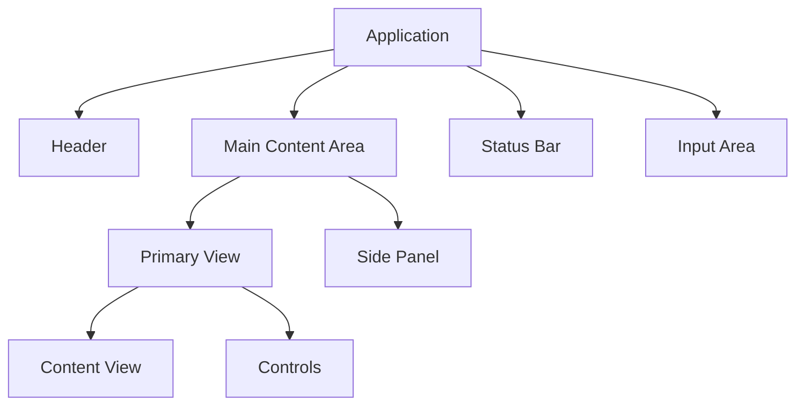

# CLI Design System Guide 2025

> Comprehensive guide for designing modern command line interfaces with Charm frameworks, responsive TUI patterns, and accessibility considerations

## Table of Contents
- [Design Principles](#design-principles)
- [Interface Architecture](#interface-architecture)
- [Component Design](#component-design)
- [Terminal UI Patterns](#terminal-ui-patterns)
- [Typography System](#typography-system)
- [Color System](#color-system)
- [Composition Guidelines](#composition-guidelines)
- [Motion & Animation](#motion--animation)
- [Style Definitions](#style-definitions)
- [Accessibility](#accessibility)
- [Responsive Design](#responsive-design)
- [Testing Guidelines](#testing-guidelines)
- [Best Practices](#best-practices)

## Design Principles

### Core Principles
- **Clarity**: Use clear, concise text and intuitive layouts
- **Consistency**: Maintain consistent patterns and behaviors throughout
- **Hierarchy**: Present information in a logical order with clear importance
- **Feedback**: Provide immediate visual and textual feedback for actions
- **Performance**: Ensure UI remains responsive even during intensive operations

### Terminal Constraints Consideration
- **Limited Color Palette**: Design with terminal color limitations in mind
- **Character Grid**: Design for fixed-width character cells instead of pixels
- **Input Methods**: Design for keyboard-centric interaction
- **Variable Dimensions**: Account for different terminal sizes
- **Font Variations**: Design for various terminal fonts and weights

## Interface Architecture

### Structure & Layout
Terminal interfaces should follow a logical structure with clear sections:



### Layout Zones
Design applications with these typical zones:

1. **Header Zone**: App title, status indicators, menu options
2. **Content Zone**: Primary information display
3. **Control Zone**: Action buttons, navigation elements
4. **Input Zone**: User text input, command entry
5. **Status Zone**: Notifications, progress indicators, help text

### Navigation Patterns
- **Tab-based**: Switch between content areas with tab key
- **Modal**: Display context-specific content in full-screen or partial overlay
- **Hierarchical**: Navigate through nested menu structures
- **Command-based**: Access functionality through typed commands

## Component Design

### Essential TUI Components
Using the Charm ecosystem to implement these fundamental components:

#### Text Input

```go
// Single-line text input
input := textinput.New()
input.Placeholder = "Enter command..."
input.CharLimit = 100
input.Width = 40

// Multi-line text area
textarea := textarea.New()
textarea.Placeholder = "Enter multi-line text..."
textarea.SetHeight(10)
textarea.SetWidth(60)
```

#### Lists and Selectors

```go
// Selectable list 
list := list.New(items, list.NewDefaultDelegate(), 0, 0)
list.Title = "Select an option"
list.SetShowStatusBar(false)
list.SetFilteringEnabled(true)
list.Styles.Title = lipgloss.NewStyle().
    Bold(true).
    Foreground(lipgloss.Color("#FAFAFA")).
    Background(lipgloss.Color("#7D56F4")).
    Padding(0, 1)
```

#### Progress Indicators

```go
// Progress bar
progressBar := progress.New(progress.WithDefaultGradient())
progressBar.Width = 80

// Spinner
spinner := spinner.New()
spinner.Spinner = spinner.Points
spinner.Style = lipgloss.NewStyle().Foreground(lipgloss.Color("205"))
```

#### Viewport (Scrollable Area)

```go
viewport := viewport.New(80, 20)
viewport.SetContent("Long scrollable content goes here...")
viewport.Style = lipgloss.NewStyle().Border(lipgloss.RoundedBorder())
```

#### Table

```go
// Create table with headers
table := lipgloss.NewStyle().
    BorderStyle(lipgloss.NormalBorder()).
    BorderForeground(lipgloss.Color("240"))

headers := []string{"Name", "Status", "Priority"}
rows := [][]string{
    {"Task 1", "In Progress", "High"},
    {"Task 2", "Pending", "Medium"},
    {"Task 3", "Completed", "Low"},
}
```

### Dialog Patterns

#### Confirmation Dialog

```go
form := huh.NewForm(
    huh.NewGroup(
        huh.NewConfirm().
            Title("Are you sure you want to proceed?").
            Description("This action cannot be undone.").
            Value(&confirmValue),
    ),
)
```

#### Input Dialog

```go
form := huh.NewForm(
    huh.NewGroup(
        huh.NewInput().
            Title("Enter your name").
            Value(&nameValue),
    ),
)
```

#### Selection Dialog

```go
form := huh.NewForm(
    huh.NewGroup(
        huh.NewSelect[string]().
            Title("Choose an option").
            Options(
                huh.NewOption("Option 1", "option1"),
                huh.NewOption("Option 2", "option2"),
                huh.NewOption("Option 3", "option3"),
            ).
            Value(&selectedOption),
    ),
)
```

## Terminal UI Patterns

### Forms & Input

Forms should follow these guidelines:
1. **Clear Labels**: Each input field should have a concise label
2. **Validation Feedback**: Provide immediate feedback for invalid input
3. **Tab Navigation**: Allow navigation between fields using tab key
4. **Default Values**: Pre-populate fields with sensible defaults when appropriate
5. **Help Text**: Include contextual help text for complex inputs

```go
form := huh.NewForm(
    huh.NewGroup(
        huh.NewInput().
            Title("Username").
            Placeholder("Enter username").
            Validate(func(s string) error {
                if len(s) < 3 {
                    return errors.New("username must be at least 3 characters")
                }
                return nil
            }).
            Value(&username),
            
        huh.NewInput().
            Title("API Key").
            Placeholder("Enter API key").
            Password(true).
            Value(&apiKey),
            
        huh.NewSelect[string]().
            Title("Theme").
            Options(
                huh.NewOption("Light", "light"),
                huh.NewOption("Dark", "dark"),
                huh.NewOption("System", "system"),
            ).
            Value(&theme),
    ),
)
```

### Progress & Loading

Show operation progress using these patterns:

1. **Determinate Progress**: Use when progress percentage is known
   ```go
   progressBar := progress.New(
       progress.WithDefaultGradient(),
       progress.WithWidth(40),
       progress.WithoutPercentage(),
   )
   ```

2. **Indeterminate Progress**: Use for unknown duration operations
   ```go
   spinner := spinner.New()
   spinner.Spinner = spinner.Dot
   spinner.Style = lipgloss.NewStyle().Foreground(lipgloss.Color("205"))
   ```

3. **Progress with Status Text**: Include descriptive text
   ```go
   progressText := "Downloading updates..."
   progressDisplay := lipgloss.JoinHorizontal(
       lipgloss.Center,
       spinner.View(), " ", progressText,
   )
   ```

### Interactive Menus

Implement menus with these approaches:

1. **Command Menu**: Access via key command (Ctrl+P, etc.)
   ```go
   cmdMenu := list.New(commandItems, list.NewDefaultDelegate(), 0, 0)
   cmdMenu.Title = "Commands"
   cmdMenu.SetShowHelp(false)
   ```

2. **Context Menu**: Show relevant actions for selected items
   ```go
   showContextMenu := func(selection string) tea.Cmd {
       menuItems := getContextMenuItems(selection)
       contextMenu := list.New(menuItems, list.NewDefaultDelegate(), 0, 0)
       // Return command to show context menu
   }
   ```

3. **Tab Bar**: Navigate between different sections
   ```go
   tabs := []string{"Dashboard", "Projects", "Settings"}
   activeTab := 0
   
   tabBar := func() string {
       var tabViews []string
       for i, tab := range tabs {
           if i == activeTab {
               tabViews = append(tabViews, activeTabStyle.Render(tab))
           } else {
               tabViews = append(tabViews, inactiveTabStyle.Render(tab))
           }
       }
       return lipgloss.JoinHorizontal(lipgloss.Top, tabViews...)
   }
   ```

## Typography System

### Font Guidelines

While terminal fonts are controlled by the user's environment, we can use styling to create a typography system:

1. **Base Text**: Regular weight, standard terminal font
   ```go
   baseTextStyle := lipgloss.NewStyle().
       Foreground(lipgloss.Color("#FAFAFA"))
   ```

2. **Headings**: Bold, potentially with background color
   ```go
   h1Style := lipgloss.NewStyle().
       Bold(true).
       Foreground(lipgloss.Color("#FAFAFA")).
       Background(lipgloss.Color("#7D56F4")).
       Padding(0, 1).
       MarginBottom(1)
       
   h2Style := lipgloss.NewStyle().
       Bold(true).
       Foreground(lipgloss.Color("#FAFAFA")).
       MarginBottom(1)
   ```

3. **Subtle Text**: Dimmed color for secondary information
   ```go
   subtleTextStyle := lipgloss.NewStyle().
       Foreground(lipgloss.Color("#888888")).
       Italic(true)
   ```

4. **Error Text**: Bold with error color
   ```go
   errorTextStyle := lipgloss.NewStyle().
       Bold(true).
       Foreground(lipgloss.Color("#FF0000"))
   ```

5. **Success Text**: Green color for success messages
   ```go
   successTextStyle := lipgloss.NewStyle().
       Foreground(lipgloss.Color("#00FF00"))
   ```

### Layout & Spacing

Create consistent spacing using styles with margins:

```go
// Standard section spacing
sectionStyle := lipgloss.NewStyle().
    MarginTop(1).
    MarginBottom(1)

// Paragraph spacing
paragraphStyle := lipgloss.NewStyle().
    MarginBottom(1)
```

## Color System

### Base Color Palette

Create a consistent color system with these base colors:

```go
// Primary brand color
primaryColor := lipgloss.Color("#7D56F4")

// Neutral colors
backgroundColor := lipgloss.Color("#1A1B26")
foregroundColor := lipgloss.Color("#FAFAFA")
subtleColor := lipgloss.Color("#888888")

// Status colors
successColor := lipgloss.Color("#73F991")
warningColor := lipgloss.Color("#FFB86C")
errorColor := lipgloss.Color("#FF5555")
infoColor := lipgloss.Color("#8BE9FD")
```

### Semantic Color Application

Use colors consistently for specific purposes:

```go
// Text colors
normalText := lipgloss.NewStyle().Foreground(foregroundColor)
highlightedText := lipgloss.NewStyle().Foreground(primaryColor).Bold(true)
subtleText := lipgloss.NewStyle().Foreground(subtleColor)

// Status colors
successText := lipgloss.NewStyle().Foreground(successColor)
warningText := lipgloss.NewStyle().Foreground(warningColor)
errorText := lipgloss.NewStyle().Foreground(errorColor)
infoText := lipgloss.NewStyle().Foreground(infoColor)

// UI element colors
activeElement := lipgloss.NewStyle().
    Background(primaryColor).
    Foreground(foregroundColor)
    
focusedBorder := lipgloss.NewStyle().
    BorderStyle(lipgloss.RoundedBorder()).
    BorderForeground(primaryColor)
```

### Color Accessibility

Ensure color combinations have sufficient contrast for terminal environments:

```go
// High contrast modes
highContrastText := lipgloss.NewStyle().
    Foreground(lipgloss.Color("#FFFFFF")).
    Background(lipgloss.Color("#000000"))
    
// Avoid problematic color combinations
// (red/green, blue/yellow) for color-blind accessibility
```

## Composition Guidelines

### Layout Composition

Compose complex layouts using Lip Gloss's layout functions:

```go
// Horizontal composition
headerLayout := lipgloss.JoinHorizontal(
    lipgloss.Center,
    appTitleStyle.Render("My CLI App"),
    lipgloss.JoinHorizontal(
        lipgloss.Right,
        statusIndicatorStyle.Render("●"),
        " Connected",
    ),
)

// Vertical composition
mainLayout := lipgloss.JoinVertical(
    lipgloss.Left,
    headerLayout,
    contentStyle.Render(contentView),
    footerStyle.Render(statusBar),
)
```

### Component Composition

Combine smaller components into larger units:

```go
// Combining progress bar with text
progressComponent := func(value float64, label string) string {
    bar := progressBar.ViewAs(value)
    return lipgloss.JoinVertical(
        lipgloss.Left,
        labelStyle.Render(label),
        bar,
    )
}

// Card-like component
cardComponent := func(title, content string) string {
    return lipgloss.JoinVertical(
        lipgloss.Left,
        cardTitleStyle.Render(title),
        cardContentStyle.Render(content),
    )
}
```

## Motion & Animation

### Progress Animation

Implement smooth progress animations:

```go
// Spinner animation
spinner := spinner.New()
spinner.Spinner = spinner.Dot
spinner.Style = lipgloss.NewStyle().Foreground(lipgloss.Color("205"))

// Progress bar with animation
progressBar := progress.New(
    progress.WithGradient("#7D56F4", "#C792EA"),
    progress.WithoutPercentage(),
)
```

### Transition Effects

Use Bubble Tea's update cycle for transitions:

```go
// Transition states
type transitionState int

const (
    transitionIn transitionState = iota
    stable
    transitionOut
)

// Implement transition in model
type Model struct {
    transition transitionState
    opacity    float64
    // other fields
}

// Update transition in update function
func (m Model) Update(msg tea.Msg) (tea.Model, tea.Cmd) {
    switch m.transition {
    case transitionIn:
        m.opacity += 0.1
        if m.opacity >= 1.0 {
            m.opacity = 1.0
            m.transition = stable
        }
        return m, tea.Tick(time.Millisecond*16, func(time.Time) tea.Msg {
            return transitionMsg{}
        })
    // Handle other states
    }
    // Rest of update logic
}
```

### Loading Sequences

Create engaging loading sequences with Bubble Tea:

```go
// Animated loading sequence
type loadingModel struct {
    spinner  spinner.Model
    progress int
    messages []string
    current  int
}

// Update to cycle through messages
func (m loadingModel) Update(msg tea.Msg) (tea.Model, tea.Cmd) {
    switch msg := msg.(type) {
    case tea.Tick:
        m.current = (m.current + 1) % len(m.messages)
        return m, tea.Tick(time.Second*2, func(time.Time) tea.Msg {
            return tea.Tick{}
        })
    // Other message handling
    }
    
    var cmd tea.Cmd
    m.spinner, cmd = m.spinner.Update(msg)
    return m, cmd
}
```

## Style Definitions

### Defining a Coherent Style System

Create a centralized style system:

```go
// styles/styles.go
package styles

import (
    "github.com/charmbracelet/lipgloss"
)

// Colors
var (
    PrimaryColor = lipgloss.Color("#7D56F4")
    TextColor = lipgloss.Color("#FAFAFA")
    SubtleColor = lipgloss.Color("#888888")
    ErrorColor = lipgloss.Color("#FF5555")
    SuccessColor = lipgloss.Color("#73F991")
)

// Text Styles
var (
    NormalText = lipgloss.NewStyle().
        Foreground(TextColor)
        
    BoldText = lipgloss.NewStyle().
        Foreground(TextColor).
        Bold(true)
        
    HeadingText = lipgloss.NewStyle().
        Foreground(TextColor).
        Bold(true).
        Background(PrimaryColor).
        Padding(0, 1)
        
    SubtleText = lipgloss.NewStyle().
        Foreground(SubtleColor)
        
    ErrorText = lipgloss.NewStyle().
        Foreground(ErrorColor).
        Bold(true)
        
    SuccessText = lipgloss.NewStyle().
        Foreground(SuccessColor)
)

// Container Styles
var (
    Border = lipgloss.NewStyle().
        BorderStyle(lipgloss.RoundedBorder()).
        BorderForeground(PrimaryColor).
        Padding(1)
        
    Panel = lipgloss.NewStyle().
        BorderStyle(lipgloss.RoundedBorder()).
        BorderForeground(SubtleColor).
        Padding(1)
)

// Component Styles
var (
    ActiveTab = lipgloss.NewStyle().
        Background(PrimaryColor).
        Foreground(TextColor).
        Bold(true).
        Padding(0, 2)
        
    InactiveTab = lipgloss.NewStyle().
        Foreground(SubtleColor).
        Padding(0, 2)
)
```

### Style Application

Apply styles consistently across the application:

```go
import (
    "github.com/your-app/styles"
)

// Using styles
title := styles.HeadingText.Render("Application Title")
errorMessage := styles.ErrorText.Render("Error: Connection failed")
content := styles.Border.Render("Panel content goes here")
```

## Accessibility

### Keyboard Navigation

Ensure all functionality is accessible via keyboard:

```go
// Implement keyboard shortcuts
func (m Model) Update(msg tea.Msg) (tea.Model, tea.Cmd) {
    switch msg := msg.(type) {
    case tea.KeyMsg:
        switch msg.String() {
        case "ctrl+s":
            return m, saveCmd
        case "ctrl+o":
            return m, openCmd
        case "tab":
            m.focusIndex = (m.focusIndex + 1) % len(m.focusable)
            return m, nil
        case "shift+tab":
            m.focusIndex = (m.focusIndex - 1 + len(m.focusable)) % len(m.focusable)
            return m, nil
        case "enter":
            return m, m.focusable[m.focusIndex].activateCmd()
        }
    }
    // Other message handling
}
```

### Screen Reader Consideration

While terminal UIs have limitations with screen readers, we can improve accessibility:

```go
// Clear text descriptions for status changes
func (m Model) Update(msg tea.Msg) (tea.Model, tea.Cmd) {
    switch msg := msg.(type) {
    case progressMsg:
        m.progress = msg.progress
        m.statusText = fmt.Sprintf("Progress: %d%%", m.progress)
        return m, nil
    }
    // Other message handling
}
```

### Color Contrast

Ensure all text has adequate contrast against its background:

```go
// High contrast mode
highContrastMode := false

// Apply high contrast when needed
textStyle := styles.NormalText
if highContrastMode {
    textStyle = lipgloss.NewStyle().
        Foreground(lipgloss.Color("#FFFFFF")).
        Background(lipgloss.Color("#000000"))
}
```

## Responsive Design

### Terminal Size Adaptation

Adapt layouts based on terminal dimensions:

```go
func (m Model) Update(msg tea.Msg) (tea.Model, tea.Cmd) {
    switch msg := msg.(type) {
    case tea.WindowSizeMsg:
        m.width = msg.Width
        m.height = msg.Height
        
        // Adjust layout based on available space
        if m.width < 80 {
            m.compactMode = true
        } else {
            m.compactMode = false
        }
        
        // Resize components
        m.viewport.Width = msg.Width
        m.viewport.Height = msg.Height - 5 // Reserve space for header and footer
        
        return m, nil
    }
    // Other message handling
}
```

### Layout Switching

Implement different layouts based on available space:

```go
// Render function with responsive layout
func (m Model) View() string {
    if m.compactMode {
        // Compact layout: vertical stacking
        return lipgloss.JoinVertical(
            lipgloss.Left,
            m.headerView(),
            m.mainView(),
            m.controlsView(),
        )
    } else {
        // Full layout: side panels
        return lipgloss.JoinHorizontal(
            lipgloss.Top,
            m.sidebarView(),
            lipgloss.JoinVertical(
                lipgloss.Left,
                m.headerView(),
                m.mainView(),
                m.controlsView(),
            ),
        )
    }
}
```

### Content Truncation

Handle content truncation gracefully:

```go
// Truncate text based on available width
truncate := func(text string, width int) string {
    if len(text) <= width {
        return text
    }
    return text[:width-3] + "..."
}

// Apply in view
itemView := func(item Item, width int) string {
    return truncate(item.Title, width)
}
```

## Testing Guidelines

### Visual Testing

Test UI appearance with different terminal dimensions:

```go
// test/ui_test.go
func TestUIRendering(t *testing.T) {
    tests := []struct {
        name   string
        width  int
        height int
    }{
        {"small_terminal", 40, 15},
        {"medium_terminal", 80, 24},
        {"large_terminal", 120, 40},
    }
    
    for _, tt := range tests {
        t.Run(tt.name, func(t *testing.T) {
            model := InitialModel()
            msg := tea.WindowSizeMsg{Width: tt.width, Height: tt.height}
            updatedModel, _ := model.Update(msg)
            
            // Render the view
            view := updatedModel.(Model).View()
            
            // Verify the view doesn't exceed dimensions
            lines := strings.Split(view, "\n")
            maxWidth := 0
            for _, line := range lines {
                if len(line) > maxWidth {
                    maxWidth = len(line)
                }
            }
            
            if maxWidth > tt.width {
                t.Errorf("View width exceeds terminal width: %d > %d", maxWidth, tt.width)
            }
            if len(lines) > tt.height {
                t.Errorf("View height exceeds terminal height: %d > %d", len(lines), tt.height)
            }
        })
    }
}
```

### Interaction Testing

Test interaction logic:

```go
func TestKeyboardInteraction(t *testing.T) {
    model := InitialModel()
    
    // Test TAB key for focus cycling
    tabPress := tea.KeyMsg{Type: tea.KeyTab}
    updatedModel, _ := model.Update(tabPress)
    if updatedModel.(Model).focusIndex != 1 {
        t.Errorf("Tab key didn't advance focus index")
    }
    
    // Test ENTER key for activation
    activated := false
    model = Model{
        focusIndex: 0,
        focusable: []Focusable{
            {activateCmd: func() tea.Cmd {
                return func() tea.Msg {
                    activated = true
                    return nil
                }
            }},
        },
    }
    
    enterPress := tea.KeyMsg{Type: tea.KeyEnter}
    updatedModel, cmd := model.Update(enterPress)
    if cmd == nil {
        t.Errorf("Enter key didn't produce activation command")
    }
    cmd()
    if !activated {
        t.Errorf("Activation command didn't execute")
    }
}
```

## Best Practices

### 1. Visual Hierarchy
- Use size, color, and positioning to denote importance
- Place primary actions in prominent positions
- Group related information visually
- Use spacing to separate logical sections

### 2. Feedback & Affordance
- Provide immediate feedback for actions
- Use visual cues to indicate interactive elements
- Show system status clearly at all times
- Confirm destructive actions

### 3. Consistency & Patterns
- Use consistent command schemes
- Apply styles uniformly across the application
- Follow platform conventions when appropriate
- Maintain consistent spacing and layout

### 4. Performance Considerations
- Minimize screen redraws when possible
- Use efficient rendering techniques
- Implement pagination for large data sets
- Handle slow operations asynchronously

### 5. Error Handling & Recovery
- Display clear error messages
- Provide actionable recovery steps
- Preserve user input when errors occur
- Log errors for diagnostics

### Resources

#### Official Documentation
- [Bubble Tea Documentation](https://github.com/charmbracelet/bubbletea)
- [Lip Gloss Documentation](https://github.com/charmbracelet/lipgloss)
- [Bubbles Component Library](https://github.com/charmbracelet/bubbles)
- [Huh Forms Documentation](https://github.com/charmbracelet/huh)

#### Design References
- [Charm Concepts Guide](https://github.com/charmbracelet/tea/blob/master/concepts.md)
- [Terminal UI Catalog](https://github.com/charmbracelet/teacup)
- [ANSI Color Standards](https://en.wikipedia.org/wiki/ANSI_escape_code#Colors)
- [No Design Development](https://nodesign.dev) 
- [Ink UI Components](https://github.com/vadimdemedes/ink)

---

*Note: This document should be periodically updated to reflect the latest best practices and available technologies for terminal UI design.* 