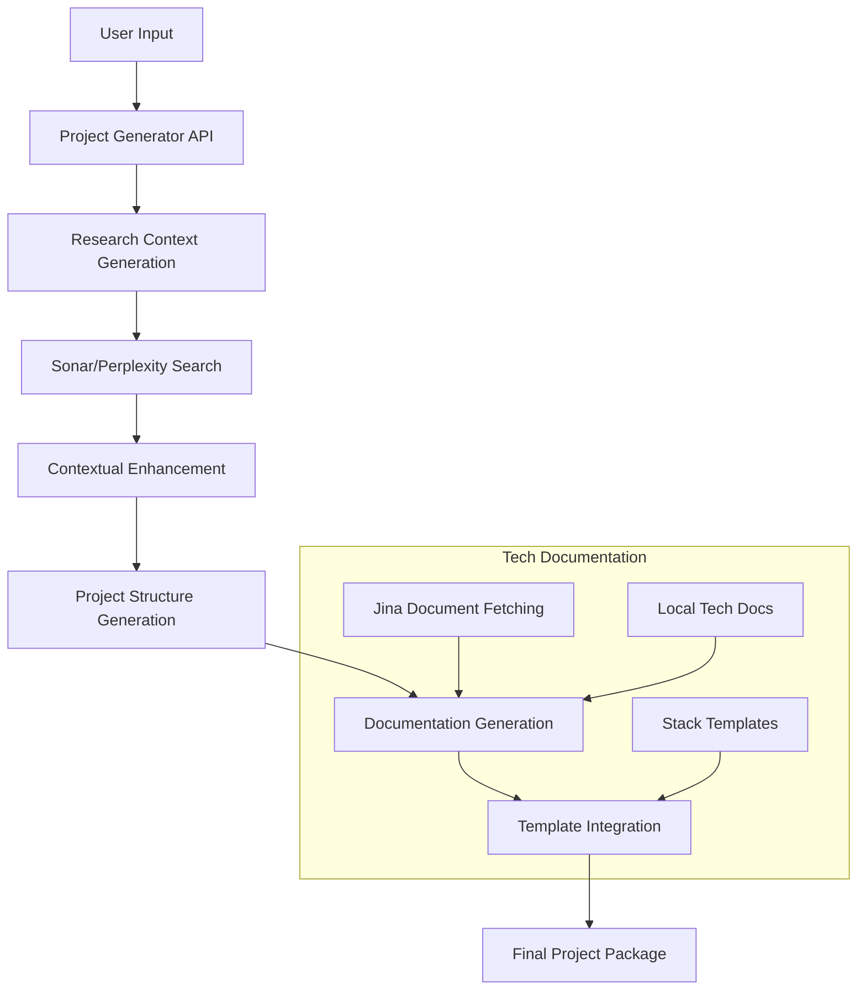

# Project Generation Architecture

## Overview

The project generation system is a sophisticated pipeline that creates comprehensive project documentation and structure based on user prompts and selected technology stacks. It integrates multiple AI services, templating engines, and research capabilities to produce contextually-rich, detailed project specifications.

## Architecture Components

## Key Components

### 1. API Layer (`src/app/api/projects/generate/route.ts`)
- Handles user requests with prompt, tech stack selection, and optional project name
- Orchestrates the entire generation process
- Implements research enhancement and error handling
- Saves generated projects to the database

### 2. LLM Integration (`src/lib/llm/index.ts`)
- `ProjectGenerator` class handles all LLM interactions
- Uses OpenRouter to access Claude 3.7 Sonnet and other models
- Implements structured prompt engineering for different document types
- Generates consistent, interlinked documentation across multiple files

### 3. Template System (`src/lib/templates.ts`)
- Maintains tech stack-specific templates for different document types
- Currently supports Next.js, Apple, CLI, and Other stacks
- Provides base structure that is enhanced with LLM-generated content
- Templates are partially loaded from filesystem and partially hard-coded

### 4. Research Enhancement
- Generates search plans with Claude for relevant topics
- Uses Perplexity/Sonar for retrieving up-to-date technical information
- Enhances documentation with current best practices and examples
- Creates follow-up queries based on initial results

### 5. Jina Integration (`src/lib/jina/index.ts`)
- Allows fetching documentation directly from tech websites
- Implements caching to reduce redundant API calls
- Extracts relevant content and metadata from technical documentation

### 6. Generated Artifacts
Currently, the system produces the following files:
- `index.md` - Project overview
- `design.md` - Design system and architecture
- `code.md` - Implementation details
- `tech.md` - Technology glossary
- `init.md` - LLM initialization context
- `instructions.md` - Project workflows
- `memory/index.md` - Memory system documentation
- `memory/bank_1.md` - Initial memory bank

## Current Workflow

1. User submits a project idea with tech stack selection
2. System generates search plan using Claude
3. Perplexity/Sonar searches retrieve relevant technical context
4. Project structure and details are generated
5. Templates are loaded for the selected tech stack
6. Documentation is generated using templates, tech context, and research
7. Final project package is assembled and saved to the database
8. Project ZIP is prepared for download

## Identified Gaps and Improvement Opportunities

### Template Utilization
- **Current state**: Templates are partially utilized, with some hard-coded values
- **Opportunity**: Fully externalize all templates to the filesystem for easier management
- **Opportunity**: Create more specialized templates per tech stack and document type

### Tech Documentation
- **Current state**: Single `tech.md` file with limited detail
- **Opportunity**: Create a `tech/` folder structure with rich documentation
- **Opportunity**: Fetch and store comprehensive documentation from r.jina.ai

### Logging and Observability
- **Current state**: Inconsistent logging across API calls
- **Opportunity**: Implement structured logging with consistent [TAG] prefixes
- **Opportunity**: Log full inputs and outputs for debugging

### Stack Template Context
- **Current state**: Templates are loaded but not fully utilized as context
- **Opportunity**: Use stack-specific templates to guide all generation steps
- **Opportunity**: Ensure complete template coverage for all tech stacks

### Output Structure
- **Current state**: Limited to a set of markdown files
- **Opportunity**: Expand to include directory structure, sample code, configuration files
- **Opportunity**: Create a more comprehensive project package

## Recommended Next Steps

1. Enhance the tech documentation system:
   - Convert `tech.md` to a `tech/` folder with `index.md`
   - Implement r.jina.ai fetching for comprehensive tech docs
   - Store these files locally in `/Users/nit/Developer/apps/luke/docs/tech`

2. Improve logging and observability:
   - Add [TAG] based logging throughout the API and LLM calls
   - Log full inputs/outputs for debugging purposes
   - Implement structured error handling with detailed information

3. Better template integration:
   - Ensure selected stack templates are used as context in all generation steps
   - Load full templates from filesystem rather than hard-coding
   - Create more specialized templates per tech stack

4. Enhance output structure:
   - Include starter code files and configuration
   - Generate a more comprehensive directory structure
   - Provide a complete project package for immediate use

5. Fix identified issues:
   - Address the Perplexity/Sonar URL path issue in the logs
   - Implement proper error handling for API failures
   - Add retry mechanisms for external API calls 