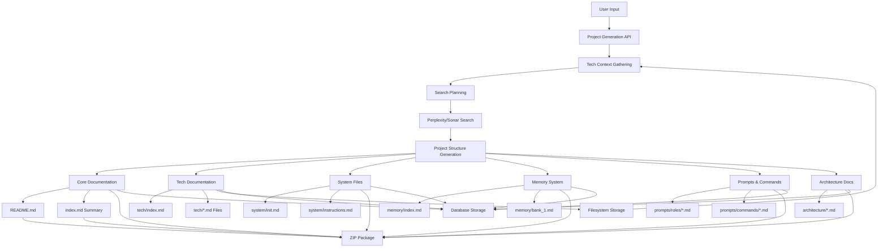
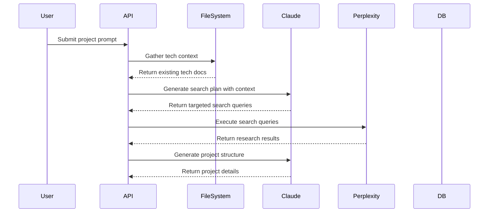
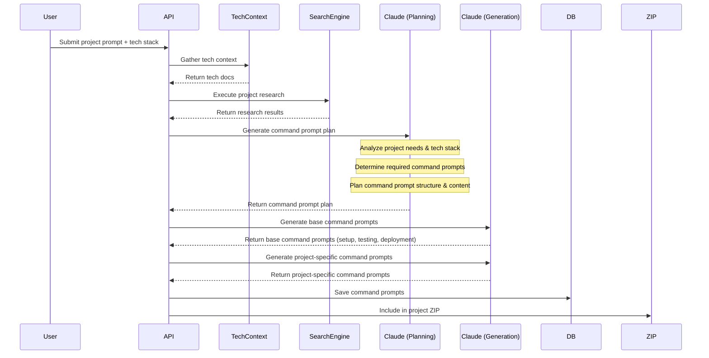

# Project Generation System: Current State and Improvements

This document describes the current state of the project generation system after recent enhancements, focusing on architectural improvements, component interactions, and technical details.

## 1. System Overview

The project generation system creates comprehensive documentation for software projects based on user prompts and selected technology stacks. It combines multiple AI models, contextual research, and templates to generate a complete set of project documentation.

### 1.1 Key Components



### 1.2 Directory Structure

The project generates documentation in a carefully organized structure:

```
project-docs/
│
├── README.md            # Human-readable GitHub README with usage instructions
├── index.md             # LLM-generated summary of all folders and files
│
├── docs/                # Core documentation
│   ├── overview.md      # Project overview (former index.md)
│   ├── design.md        # Architecture and design decisions
│   ├── code.md          # Implementation guide
│   ├── deployment.md    # Deployment guide
│   └── README.md        # Summary of core documentation
│
├── tech/                # Technology documentation
│   ├── index.md         # Tech overview (former tech.md)
│   ├── [technology1].md # Individual tech documentation
│   ├── [technology2].md
│   └── README.md        # Summary of tech documentation
│
├── system/              # LLM system files
│   ├── init.md          # LLM system/utility prompt
│   ├── instructions.md  # Project-specific workflow instructions
│   └── README.md        # Guide to using system files
│
├── memory/              # Memory system for agentic LLMs
│   ├── index.md         # Memory system guide
│   ├── bank_1.md        # Initial memory bank
│   └── README.md        # Memory system usage instructions
│
├── prompts/             # Role and workflow prompts
│   ├── roles/           # Role-specific prompts
│   │   ├── architect.md # Architecture-focused role
│   │   ├── developer.md # Development-focused role
│   │   ├── designer.md  # Design-focused role
│   │   └── enterprise.md # Business/growth-focused role
│   ├── commands/        # Workflow-specific command prompts
│   │   ├── setup.md     # Project setup commands
│   │   ├── testing.md   # Testing workflow commands
│   │   ├── deployment.md # Deployment workflow commands
│   │   └── [workflow].md # Additional workflow-specific commands
│   └── README.md        # Guide to using prompts and commands
│
└── architecture/        # Architecture documentation
    ├── sample-feature.md # Sample architecture document
    ├── components.md    # Component architecture
    └── README.md        # Architecture documentation guide
```

This improved structure:

1. **Organizes content into clear top-level folders** for better navigation
2. **Adds README.md files** in each directory for human-readable guidance
3. **Includes a top-level index.md** with an LLM-generated summary of all content
4. **Separates roles from commands** in the prompts directory
5. **Adds a dedicated system directory** for LLM initialization files
6. **Renames index.md to overview.md** in the docs folder to avoid confusion with directory indices

## 2. Recent Improvements

### 2.1 Enhanced Tech Documentation

The system now generates individual tech documentation files for each technology in the project stack. These files are:

1. Stored in the `tech/` directory in the generated ZIP
2. Written to the local filesystem at `/docs/tech/` for reuse across projects
3. Stored in the database as JSON in the `techFilesJson` field
4. Referenced by tech documentation from future projects

This creates a growing knowledge base of technology documentation that improves over time.

### 2.2 Structured Logging

All components now use a structured logging system with:

1. Consistent `[TAG]` prefixes for easier log filtering
2. Standardized log levels (INFO, WARN, ERROR)
3. Structured data for more detailed debugging
4. Redaction of sensitive information

### 2.3 Efficient Context Bundling

The system now gathers existing tech documentation before initiating searches:

1. Loads documentation from the local filesystem
2. Includes tech stack-specific templates
3. Bundles this context for more informed search planning
4. Results in more targeted searches and better research results

### 2.4 Project Name Consistency

All document prompts now consistently use the actual project name instead of a generic "Project" placeholder, ensuring consistency across all generated documents.

### 2.5 Enhanced API Resilience

The system implements:

1. Improved error handling for API calls
2. Retry mechanisms with exponential backoff
3. Graceful fallbacks when services are unavailable
4. Better caching to reduce API calls

## 3. Database Schema

The database schema has been updated to fully support the enhanced document structure:

```prisma
model GeneratedProject {
  // Basic project info
  id          String   @id @default(cuid())
  name        String
  emoji       String
  description String
  sourceUrl   String
  createdAt   DateTime
  updatedAt   DateTime

  // Project content sections
  overviewItems     String[]
  coreItems         String[]
  architectureItems String[]
  techItems         String[]
  techItemsJson     String?  // JSON string of tech items with docs URLs

  // Core documents
  indexDocument     String?
  designDocument    String?
  codeDocument      String?
  techDocument      String?  // Main tech index
  initDocument      String?

  // Tech documentation files
  techFilesJson     String?  // JSON object of tech files

  // Enhanced agentic workflow documents
  instructionsDocument      String?
  memoryIndexDocument       String?
  memoryBankDocument        String?
  promptArchitectDocument   String?
  promptDeveloperDocument   String?
  promptDesignerDocument    String?
  promptEnterpriseDocument  String?
  architectureSampleDocument String?
  deploymentDocument        String?

  // Command prompts (workflow documents)
  commandPromptsJson        String?  // JSON object of command prompts {filename: content}
  
  // Project-specific architecture documents
  architectureDocsJson      String?  // JSON object of architecture docs {filename: content}

  // User metadata
  userPrompt      String
  userIp          String?
  userFingerprint String?
}
```

## 4. Key Generation Workflow

### 4.1 Pre-Search Context Gathering



### 4.2 Tech Documentation Generation

The system creates tech documentation through a multi-step process:

1. **Main Index Generation**: Creates `tech/index.md` with an overview of all technologies
2. **Individual Tech Files**: For each technology in the stack:
   - Attempts to fetch documentation from web sources via `r.jina.ai/<url>`
   - Falls back to LLM generation if fetch fails
   - Stores the file in local filesystem at `docs/tech/[tech-name].md`
   - Includes the file in the generated ZIP at `tech/[tech-name].md`

### 4.3 Document Enhancement

Each document is enhanced with:

1. **Research Context**: Insights from web searches are incorporated
2. **Cross-References**: References to other documents are added
3. **Resource Sections**: Each core document gets a resources section
4. **Project-Specific Details**: Documents are tailored to the project

### 4.4 ZIP Package Structure

The system creates a ZIP package with the following structure:

```
project-docs/
│
├── README.md
├── index.md
│
├── docs/
│   ├── overview.md
│   ├── design.md
│   ├── code.md
│   ├── deployment.md
│   └── README.md
│
├── tech/
│   ├── index.md
│   ├── [technology1].md
│   ├── [technology2].md
│   └── README.md
│
├── system/
│   ├── init.md
│   ├── instructions.md
│   └── README.md
│
├── memory/
│   ├── index.md
│   ├── bank_1.md
│   └── README.md
│
├── prompts/
│   ├── roles/
│   │   ├── architect.md
│   │   ├── developer.md
│   │   ├── designer.md
│   │   └── enterprise.md
│   ├── commands/
│   │   ├── setup.md
│   │   ├── testing.md
│   │   ├── deployment.md
│   │   └── [custom-workflow].md
│   └── README.md
│
└── architecture/
    ├── sample-feature.md
    ├── components.md
    ├── [feature1].md
    └── README.md
```

The ZIP creation process:

1. Creates the directory structure
2. Adds core documents (from direct LLM generation)
3. Adds tech documentation (from enriched sources)
4. Adds system files (init.md, instructions.md)
5. Adds memory system files
6. Adds role prompt documents
7. Adds command prompt documents (from the command prompt generation workflow)
8. Adds architecture documents
9. Adds README files for each directory
10. Compresses everything into a single ZIP file

This comprehensive package provides everything needed for both human developers and agentic LLMs to work with the project effectively.

## 5. Filesystem Integration

The system interacts with the filesystem in several ways:

1. **Reading**: Loads templates and existing tech documentation
2. **Writing**: Saves generated tech documentation for future reuse
3. **Bundling**: Creates ZIP packages with the complete documentation set

## 6. UI Integration

The `ProjectGenerator.tsx` component provides:

1. **Input Form**: For project prompts and tech stack selection
2. **Document Preview**: Shows generated documents
3. **Floating Document Panel**: Provides access to all documents
4. **Toast Notifications**: Alerts users when documents are ready

## 7. Future Improvements

While the current system is greatly improved, several areas could be enhanced further:

### 7.1 Enhanced Tech Documentation

- Add automated tech documentation update schedules
- Implement version tracking for documentation
- Create cross-references between related technologies

### 7.2 System Integrations

- Improve synergy between web app and CLI
- Implement collaborative editing of generated documents
- Add project history and versioning

### 7.3 UI Enhancements

- Provide real-time progress indicators for document generation
- Implement document comparison between versions
- Add filtering and search for generated documents

### 7.4 Context Optimization

- Implement semantic chunking for more efficient context use
- Create a tiered approach to context inclusion
- Add support for embedding-based document similarity

## 8. Conclusion

The project generation system has evolved significantly with improved documentation structure, enhanced tech documentation, better error handling, and more consistent output. These changes create a more robust foundation for future development and a better user experience.

By maintaining tech documentation across projects and implementing a structured approach to context gathering, the system can leverage previous knowledge to improve future project generation, creating a virtuous cycle of improvement.

## 9. Command Prompt Generation Workflow

To generate framework-specific but template-agnostic command prompt documents, the system implements an extended workflow that builds upon the base project generation process. This workflow ensures that workflow command prompts are tailored to the specific project requirements while remaining consistent across different tech stacks.

### 9.1 Workflow Command Generation Process



### 9.2 Command Prompt Planning

The system uses Claude to analyze the project requirements and tech stack to determine which command prompts are needed. This planning phase generates a structured outline of required command prompts, including:

1. **Base Command Prompts**:
   - setup.md
   - testing.md
   - deployment.md

2. **Project-Specific Command Prompts** (determined based on project context):
   - Database-related workflows
   - Authentication workflows
   - State management patterns
   - Performance optimization guides
   - CI/CD workflows
   - Any specialized tooling workflows

The planning phase uses a special prompt structure:

```
You are an expert software engineering workflow architect.
Given the following project details and tech stack, determine the essential command prompts
that should be created to guide developers through common workflows for this project.

PROJECT DESCRIPTION: 
[Project description from user]

TECH STACK:
[Tech stack details]

RESEARCH CONTEXT:
[Summarized research findings]

For each command prompt:
1. Provide a filename (e.g., "database-migrations.md")
2. Explain why this prompt is necessary for this project
3. Outline the key sections and commands that should be included
4. Note any tech stack-specific considerations

Output your response as valid JSON in the following format:
{
  "baseCommandPrompts": [
    {
      "filename": "setup.md",
      "rationale": "...",
      "sections": ["...", "..."],
      "techConsiderations": "..."
    },
    ...
  ],
  "projectSpecificPrompts": [
    {
      "filename": "custom-workflow.md",
      "rationale": "...",
      "sections": ["...", "..."],
      "techConsiderations": "..."
    },
    ...
  ]
}
```

### 9.3 Base Command Prompt Generation

The system generates the base command prompts (setup.md, testing.md, deployment.md) using a combination of:

1. Pre-defined templates with placeholders
2. Project-specific details derived from research
3. Tech stack-specific commands and workflows

The base prompt templates are framework-agnostic but include conditional sections that are populated based on the selected tech stack.

### 9.4 Project-Specific Command Prompt Generation

For each project-specific command prompt identified in the planning phase, the system generates custom content using another Claude prompt:

```
You are an expert in [SPECIFIC_DOMAIN] development workflows.
Create a comprehensive command prompt document that guides developers through
[SPECIFIC_WORKFLOW] for a [PROJECT_TYPE] project using [TECH_STACK].

The document should:
1. Explain the purpose of these commands
2. Provide step-by-step instructions
3. Include example commands with explanations
4. Cover common issues and troubleshooting
5. Link to relevant documentation files (design.md, tech docs, etc.)

TECH STACK DETAILS:
[Tech stack information]

PROJECT CONTEXT:
[Project specifics relevant to this workflow]

RESEARCH FINDINGS:
[Research data relevant to this workflow]

Format the document following the established command prompt template structure.
```

### 9.5 Ensuring Framework Agnosticism

While the command prompts are tailored to the specific project and tech stack, they maintain framework agnosticism through:

1. **Conditional Sections**: Each command prompt can have tech-specific code blocks labeled with the relevant tech stack.
2. **Abstracted Concepts**: Workflow concepts are described in general terms first, then with specific examples.
3. **Cross-References**: Links to the relevant tech documentation for framework-specific details.

For example, in a setup.md file:

```markdown
## Installation

### General Steps
1. Clone the repository
2. Install dependencies
3. Configure environment

### Framework-Specific Commands

<!-- Next.js -->
```bash
# Next.js project setup
npm install
cp .env.example .env.local
npm run dev
```

<!-- Swift/iOS -->
```bash
# iOS project setup
pod install
open ProjectName.xcworkspace
```

For detailed framework-specific instructions, see:
- Next.js: refer to `tech/next.js.md`
- iOS: refer to `tech/swift.md`
```

### 9.6 Integration with Existing Documentation

The generated command prompts are integrated with the rest of the documentation system through:

1. References in `system/instructions.md` to guide the agent to the appropriate commands
2. Cross-references in role-specific prompts (architect.md, developer.md, etc.)
3. Mentions in the project `index.md` for navigation

This ensures that despite being generated as separate steps, the command prompts form a cohesive part of the overall documentation system.

### 9.7 Storage and Retrieval

The generated command prompts are:

1. Stored in the database as part of the `GeneratedProject` model
2. Included in the ZIP package in the `prompts/commands/` directory
3. Available for future reference and regeneration

By using this extended workflow, the system can create highly specific, contextually relevant command prompts that guide developers through the exact workflows needed for their project, regardless of which tech stack they've selected.

### 9.8 Implementation Pseudo-Code

Here's a pseudo-code implementation of the command prompt generation workflow to guide development:

```typescript
// Generate command prompts based on project details and tech stack
async function generateCommandPrompts(
  projectName: string,
  projectDescription: string,
  techStack: TechStack,
  researchContext: string
): Promise<Record<string, string>> {
  
  // Step 1: Generate command prompt plan using Claude
  const commandPromptPlan = await generateCommandPromptPlan(
    projectName,
    projectDescription,
    techStack,
    researchContext
  );
  
  // Step 2: Generate base command prompts
  const baseCommandPrompts: Record<string, string> = {};
  
  for (const promptInfo of commandPromptPlan.baseCommandPrompts) {
    const content = await generateBaseCommandPrompt(
      promptInfo.filename,
      projectName,
      techStack,
      promptInfo.sections,
      promptInfo.techConsiderations
    );
    
    baseCommandPrompts[promptInfo.filename] = content;
  }
  
  // Step 3: Generate project-specific command prompts
  const projectSpecificPrompts: Record<string, string> = {};
  
  for (const promptInfo of commandPromptPlan.projectSpecificPrompts) {
    const content = await generateProjectSpecificCommandPrompt(
      promptInfo.filename,
      projectName,
      projectDescription,
      techStack,
      researchContext,
      promptInfo.rationale,
      promptInfo.sections
    );
    
    projectSpecificPrompts[promptInfo.filename] = content;
  }
  
  // Step 4: Combine all command prompts
  return {
    ...baseCommandPrompts,
    ...projectSpecificPrompts
  };
}

// Generate command prompt plan using Claude
async function generateCommandPromptPlan(
  projectName: string,
  projectDescription: string,
  techStack: TechStack, 
  researchContext: string
): Promise<{
  baseCommandPrompts: Array<{
    filename: string;
    rationale: string;
    sections: string[];
    techConsiderations: string;
  }>;
  projectSpecificPrompts: Array<{
    filename: string;
    rationale: string;
    sections: string[];
    techConsiderations: string;
  }>;
}> {
  // Construct the prompt for Claude
  const prompt = `
    You are an expert software engineering workflow architect.
    Given the following project details and tech stack, determine the essential command prompts
    that should be created to guide developers through common workflows for this project.
    
    PROJECT NAME: ${projectName}
    
    PROJECT DESCRIPTION: 
    ${projectDescription}
    
    TECH STACK:
    ${JSON.stringify(techStack, null, 2)}
    
    RESEARCH CONTEXT:
    ${researchContext.substring(0, 2000)}... (truncated)
    
    For each command prompt:
    1. Provide a filename (e.g., "database-migrations.md")
    2. Explain why this prompt is necessary for this project
    3. Outline the key sections and commands that should be included
    4. Note any tech stack-specific considerations
    
    Output your response as valid JSON in the following format:
    {
      "baseCommandPrompts": [
        {
          "filename": "setup.md",
          "rationale": "...",
          "sections": ["...", "..."],
          "techConsiderations": "..."
        },
        ...
      ],
      "projectSpecificPrompts": [
        {
          "filename": "custom-workflow.md",
          "rationale": "...",
          "sections": ["...", "..."],
          "techConsiderations": "..."
        },
        ...
      ]
    }
  `;
  
  // Call Claude API
  const response = await callClaudeAPI(prompt, {
    model: "claude-3-7-sonnet",
    temperature: 0.2,
    max_tokens: 4000,
    response_format: { type: "json_object" }
  });
  
  // Parse and return the plan
  return JSON.parse(response.content);
}

// Generate base command prompt using templates and tech-specific details
async function generateBaseCommandPrompt(
  filename: string,
  projectName: string,
  techStack: TechStack,
  sections: string[],
  techConsiderations: string
): Promise<string> {
  // Load the base template for this command prompt type
  const templatePath = path.join(TEMPLATE_DIR, 'prompts', 'commands', filename);
  let template = '';
  
  if (fs.existsSync(templatePath)) {
    template = fs.readFileSync(templatePath, 'utf8');
  } else {
    // If template doesn't exist, use a generic template
    template = `# ${filename.replace('.md', '').toUpperCase()} Commands\n\nThis document provides commands for ${filename.replace('.md', '')} the project.\n\n`;
  }
  
  // Replace placeholders
  template = template.replace('[PROJECT_NAME]', projectName);
  
  // Generate tech-specific content
  const techSpecificContent = await generateTechSpecificContent(
    filename.replace('.md', ''),
    techStack,
    techConsiderations
  );
  
  // Inject tech-specific content
  const finalContent = injectTechSpecificContent(template, techSpecificContent);
  
  return finalContent;
}

// Generate project-specific command prompt
async function generateProjectSpecificCommandPrompt(
  filename: string,
  projectName: string,
  projectDescription: string,
  techStack: TechStack,
  researchContext: string,
  rationale: string,
  sections: string[]
): Promise<string> {
  // Determine the specific domain based on filename
  const domain = getDomainFromFilename(filename);
  
  // Construct the prompt for Claude
  const prompt = `
    You are an expert in ${domain} development workflows.
    Create a comprehensive command prompt document that guides developers through
    ${filename.replace('.md', '')} workflows for a ${projectName} project using ${getTechStackSummary(techStack)}.
    
    The document should:
    1. Explain the purpose of these commands
    2. Provide step-by-step instructions
    3. Include example commands with explanations
    4. Cover common issues and troubleshooting
    5. Link to relevant documentation files (design.md, tech docs, etc.)
    
    TECH STACK DETAILS:
    ${JSON.stringify(techStack, null, 2)}
    
    PROJECT DESCRIPTION:
    ${projectDescription}
    
    RATIONALE FOR THIS DOCUMENT:
    ${rationale}
    
    KEY SECTIONS TO INCLUDE:
    ${sections.join('\n')}
    
    RESEARCH FINDINGS:
    ${researchContext.substring(0, 1500)}... (truncated)
    
    Format the document following this structure:
    
    # [Title: Workflow Name] Commands
    
    > Brief description of what these commands help accomplish
    
    ## Overview
    
    [Explain the purpose and importance of these commands]
    
    ## Prerequisites
    
    [List any requirements before using these commands]
    
    ## Command Categories
    
    ### [Category 1]
    
    \`\`\`bash
    # Command example
    command --option value
    \`\`\`
    
    [Explanation of what this command does]
    
    ### [Category 2]
    
    ...
    
    ## Troubleshooting
    
    ### Common Issues
    
    1. **[Issue 1]**
       [Solution]
    
    2. **[Issue 2]**
       [Solution]
  `;
  
  // Call Claude API
  const response = await callClaudeAPI(prompt, {
    model: "claude-3-7-sonnet",
    temperature: 0.3,
    max_tokens: 4000
  });
  
  return response.content;
}

// Helper function to inject tech-specific content into templates
function injectTechSpecificContent(
  template: string,
  techSpecificContent: Record<string, string>
): string {
  let result = template;
  
  // Look for framework-specific placeholders
  const placeholderRegex = /\{\{([A-Z_]+)_COMMANDS\}\}/g;
  
  result = result.replace(placeholderRegex, (match, framework) => {
    return techSpecificContent[framework] || '';
  });
  
  return result;
}

// Helper function to extract domain from filename
function getDomainFromFilename(filename: string): string {
  const name = filename.replace('.md', '');
  
  const domainMap: Record<string, string> = {
    'database-migrations': 'database management',
    'authentication': 'user authentication',
    'state-management': 'state management',
    'api-integration': 'API integration',
    'performance-optimization': 'performance optimization',
    'ci-cd': 'CI/CD',
    'debugging': 'debugging and troubleshooting'
  };
  
  return domainMap[name] || name.replace(/-/g, ' ');
}

### 9.9 Implementation Plan

To integrate the command prompt generation workflow into the existing project generation system, follow these steps:

1. **Update Database Schema**
   - Add `commandPromptsJson` field to the `GeneratedProject` model in Prisma schema
   - Create a migration to apply the schema change
   - Update type definitions to include the new field

2. **Create Command Prompt Templates**
   - Create base templates for common workflows (setup.md, testing.md, deployment.md)
   - Store them in `docs/template/prompts/commands/`
   - Include framework-specific placeholder sections where needed

3. **Implement Command Prompt Planning**
   - Create a new function `generateCommandPromptPlan` in `src/lib/llm/index.ts`
   - Add LLM prompt template for determining required command prompts
   - Use Claude 3.7 Sonnet for high-quality JSON planning output
   - Parse and validate the response

4. **Implement Base Command Prompt Generation**
   - Create a function for generating base command prompts
   - Use templates with project-specific and tech-specific replacements
   - Ensure cross-references to other documentation

5. **Implement Project-Specific Command Prompt Generation**
   - Create a function for generating custom workflow command prompts
   - Use a separate LLM call for each required custom prompt
   - Include relevant research context for each prompt

6. **Update ZIP Creation Process**
   - Modify `createZipFile` function to include command prompts directory
   - Create appropriate subdirectories for roles and commands
   - Add README.md files for each directory

7. **Update Project Response Format**
   - Include command prompts in the project generation response
   - Store command prompts JSON in the database
   - Provide access via the API for retrieval

8. **Integrate with Main Generation Flow**
   - Add command prompt generation as a step in project generation
   - Position it after main document generation but before ZIP creation
   - Pass relevant context from previous steps

9. **Update Unit Tests**
   - Add tests for command prompt generation
   - Test with different tech stacks
   - Verify JSON structure and content

10. **Add Monitoring and Logging**
    - Add structured logging for command prompt generation steps
    - Track generation time and success/failure
    - Monitor token usage for LLM calls

11. **Documentation**
    - Update API documentation to reflect new features
    - Add examples of command prompt usage in instructions.md
    - Document the command prompt generation process

The implementation should be staged in the following order:

**Phase 1: Foundation**
- Database schema update
- Base templates
- Response format updates

**Phase 2: Core Generation**
- Command prompt planning
- Base command prompt generation
- ZIP integration

**Phase 3: Enhancement**
- Project-specific command prompt generation
- Cross-referencing improvements
- Optimization and refinement

This phased approach allows for incremental implementation and testing while ensuring the core functionality is available early in the development process. 