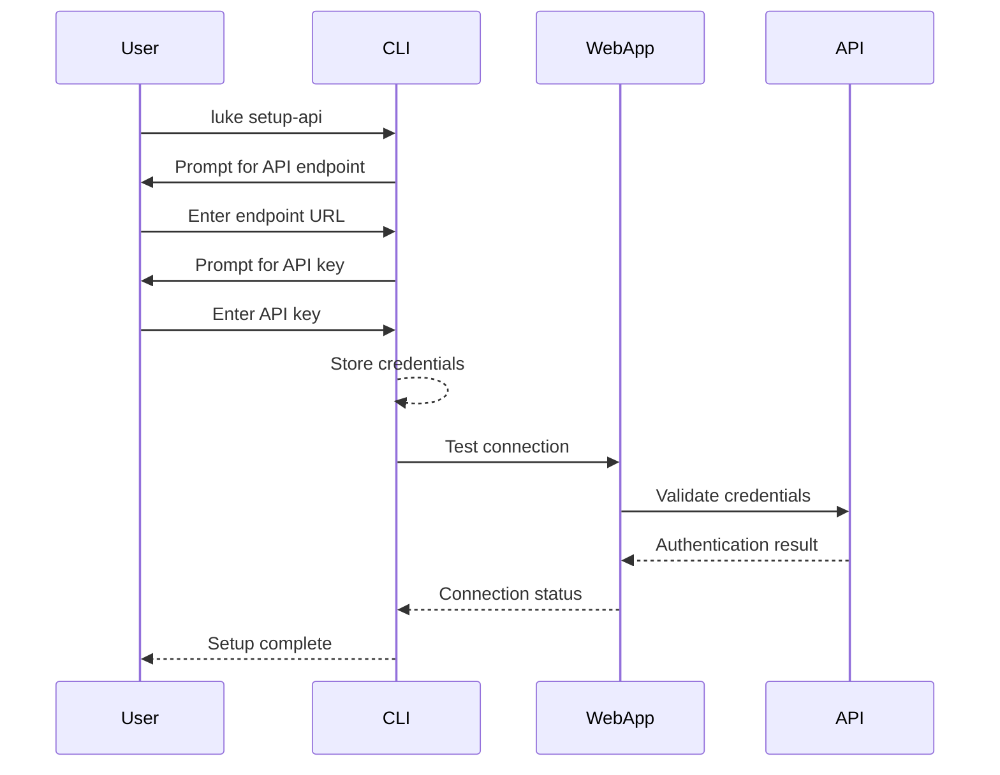

# Luke CLI and Web App Integration Architecture

```
                           ┌─────────────────┐
                           │                 │
                           │  OpenRouter API │
                           │                 │
                           └───────┬─────────┘
                                   │
              ┌───────────────────┼───────────────────┐
              │                   │                   │
    ┌─────────▼─────────┐ ┌──────▼───────┐ ┌─────────▼─────────┐
    │                   │ │              │ │                   │
    │  Web Application  │ │ Jina API     │ │ Vercel Blob      │
    │  (Next.js)        │ │              │ │ Storage          │
    │                   │ │              │ │                   │
    └─────┬─────────────┘ └──────────────┘ └───────────┬───────┘
          │                                            │
    ┌─────▼────────────────────────────────────────────▼───────┐
    │                                                          │
    │                    API Routes                            │
    │                                                          │
    ├──────────────┬───────────────┬──────────────┬────────────┤
    │              │               │              │            │
    │ /api/llm     │ /api/tech     │ /api/tech    │ /api/tech  │
    │              │ /docs/[name]  │ /crawl       │ /update    │
    │              │               │              │            │
    └──────┬───────┴───────┬───────┴──────┬───────┴──────┬─────┘
           │               │              │              │
           │               │              │              │
    ┌──────▼──────┐ ┌──────▼────────┐    │         ┌────▼───────┐
    │             │ │               │    │         │            │
    │  CLI        │ │ API Adapter   │    │         │ Frontend   │
    │  (Go)       ◄─┤ (Go)          │    │         │ Components │
    │             │ │               │    │         │            │
    └─────────────┘ └───────────────┘    │         └────────────┘
                                         │
                                    ┌────▼────────────┐
                                    │                 │
                                    │ Project         │
                                    │ Generator       │
                                    │                 │
                                    └─────────────────┘
```

This diagram illustrates how the Go-based CLI application integrates with the Next.js web application through the API adapter layer. Both applications leverage shared external services (OpenRouter API, Jina API, and Vercel Blob Storage) and communicate through a common set of API routes.

## Dependency Flow

1. **CLI Dependencies**:
   - Go modules (managed via go.mod and go.sum)
   - Key packages: Bubble Tea, Lip Gloss, Glamour for TUI
   - HTTP client libraries for API communication

2. **API Adapter Dependencies**:
   - Standard Go HTTP client
   - JSON encoding/decoding
   - Authentication handling

3. **Web App Dependencies**:
   - Next.js framework
   - React components
   - Vercel AI SDK
   - OpenRouter client

## Build Process

The CLI application is built using Go's standard build tools:

```bash
# Navigate to CLI directory
cd cli

# Ensure dependencies are up-to-date
go mod download
go mod tidy

# Build the application
go build -o luke

# Install to a directory in PATH
cp luke /path/to/bin/
```

## Authentication Flow



The architecture enables consistent functionality across both interfaces while maintaining separation of concerns between the frontend components and CLI tools. 