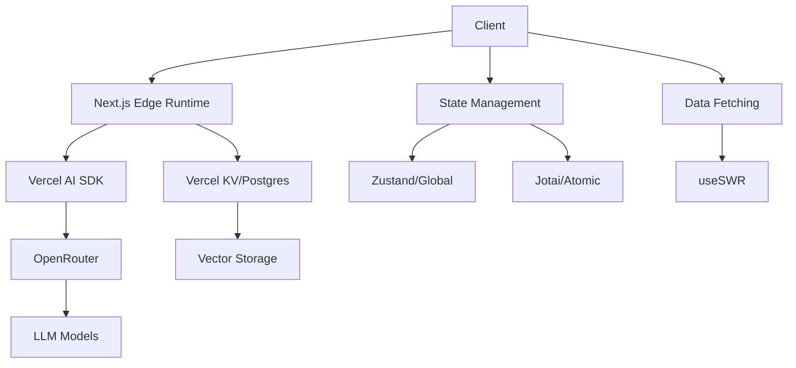

# AI Integration Guide for Next.js 2025

> Comprehensive guide for integrating AI capabilities using OpenRouter, Vercel AI SDK, and modern state management

## Table of Contents
- [Architecture Overview](#architecture-overview)
- [State Management](#state-management)
- [Data Layer Design](#data-layer-design)
- [Integration Setup](#integration-setup)
- [Prompt Engineering](#prompt-engineering)
- [UI/UX Patterns](#uiux-patterns)
- [Performance Optimization](#performance-optimization)
- [AI-Native UX Patterns](#ai-native-ux-patterns)

## Architecture Overview

### Core Components
- **OpenRouter**: Multi-model LLM gateway
- **Vercel AI SDK**: Streaming UI and state management
- **Vercel KV/Postgres**: Persistence and vector storage
- **Zustand/Jotai**: State management
- **useSWR**: Data fetching with suspense
- **Speed Insights**: Performance monitoring

### System Design


## State Management

### AI Store with Zustand
```typescript
// lib/stores/ai-store.ts
import { create } from 'zustand'
import { persist } from 'zustand/middleware'

interface Message {
  id: string
  role: 'user' | 'assistant' | 'system'
  content: string
  createdAt: Date
}

interface AIState {
  messages: Message[]
  isStreaming: boolean
  modelConfig: {
    temperature: number
    maxTokens: number
    model: string
  }
  addMessage: (message: Message) => void
  setStreaming: (streaming: boolean) => void
  updateConfig: (config: Partial<AIState['modelConfig']>) => void
  clearMessages: () => void
}

export const useAIStore = create<AIState>()(
  persist(
    (set) => ({
      messages: [],
      isStreaming: false,
      modelConfig: {
        temperature: 0.7,
        maxTokens: 4096,
        model: 'gpt-4-turbo-preview',
      },
      addMessage: (message) =>
        set((state) => ({
          messages: [...state.messages, message],
        })),
      setStreaming: (streaming) =>
        set({ isStreaming: streaming }),
      updateConfig: (config) =>
        set((state) => ({
          modelConfig: { ...state.modelConfig, ...config },
        })),
      clearMessages: () => set({ messages: [] }),
    }),
    {
      name: 'ai-store',
    }
  )
)
```

### Atomic State with Jotai
```typescript
// lib/atoms/ai-atoms.ts
import { atom } from 'jotai'
import { atomWithStorage } from 'jotai/utils'

export const modelConfigAtom = atomWithStorage('modelConfig', {
  temperature: 0.7,
  maxTokens: 4096,
  model: 'gpt-4-turbo-preview',
})

export const streamingAtom = atom(false)
export const currentMessageAtom = atom('')
export const messageHistoryAtom = atom<Message[]>([])

// Derived atoms
export const hasMessagesAtom = atom(
  (get) => get(messageHistoryAtom).length > 0
)

export const lastMessageAtom = atom(
  (get) => {
    const messages = get(messageHistoryAtom)
    return messages[messages.length - 1]
  }
)
```

## Data Layer Design

### SWR Configuration
```typescript
// lib/swr-config.ts
import { SWRConfig } from 'swr'

export function SWRProvider({ children }: { children: React.ReactNode }) {
  return (
    <SWRConfig
      value={{
        fetcher: (url: string) => fetch(url).then((r) => r.json()),
        suspense: true,
        revalidateOnFocus: false,
      }}
    >
      {children}
    </SWRConfig>
  )
}
```

### Data Fetching Hooks
```typescript
// lib/hooks/use-conversation.ts
import useSWR from 'swr'
import { useAIStore } from '../stores/ai-store'

export function useConversation(id: string) {
  const { data, error, mutate } = useSWR(
    `/api/conversations/${id}`,
    {
      suspense: true,
      revalidateOnFocus: false,
    }
  )

  const addMessage = useAIStore((state) => state.addMessage)

  const sendMessage = async (content: string) => {
    const message = {
      id: crypto.randomUUID(),
      role: 'user',
      content,
      createdAt: new Date(),
    }

    addMessage(message)

    const response = await fetch('/api/chat', {
      method: 'POST',
      body: JSON.stringify({ messages: [...data.messages, message] }),
    })

    if (!response.ok) {
      throw new Error('Failed to send message')
    }

    mutate()
  }

  return {
    conversation: data,
    isLoading: !error && !data,
    isError: error,
    sendMessage,
    mutate,
  }
}
```

### Vector Storage Integration
```typescript
// lib/vector-storage.ts
import { sql } from '@vercel/postgres'
import { kv } from '@vercel/kv'

interface VectorData {
  id: string
  content: string
  embedding: number[]
  metadata: Record<string, any>
}

export async function storeVector(data: VectorData) {
  await sql`
    INSERT INTO vectors (id, content, embedding, metadata)
    VALUES (${data.id}, ${data.content}, ${data.embedding}, ${data.metadata})
  `

  await kv.set(`vector:${data.id}`, data)
}

export async function searchSimilar(
  embedding: number[],
  limit: number = 5
) {
  const results = await sql`
    SELECT id, content, metadata,
           embedding <-> ${embedding}::vector as distance
    FROM vectors
    ORDER BY distance
    LIMIT ${limit}
  `

  return results.rows
}
```

## Integration Setup

### OpenRouter Configuration
```typescript
// lib/openrouter.ts
import { OpenRouter } from 'openrouter'
import { useAIStore } from './stores/ai-store'

export const openrouter = new OpenRouter({
  apiKey: process.env.OPENROUTER_API_KEY!,
  defaultModel: 'google/gemini-pro',
})

export function useOpenRouter() {
  const { modelConfig } = useAIStore()

  const generateStream = async (messages: Message[]) => {
    const response = await openrouter.chat.completions.create({
      model: modelConfig.model,
      messages,
      temperature: modelConfig.temperature,
      max_tokens: modelConfig.maxTokens,
      stream: true,
    })

    return response
  }

  return { generateStream }
}
```

### Chat Component
```typescript
// components/chat/chat-container.tsx
import { useAIStore } from '@/lib/stores/ai-store'
import { useConversation } from '@/lib/hooks/use-conversation'
import { Suspense } from 'react'

export function ChatContainer({ id }: { id: string }) {
  const {
    conversation,
    isLoading,
    sendMessage,
  } = useConversation(id)

  const { isStreaming } = useAIStore()

  return (
    <div className="flex flex-col h-full">
      <Suspense fallback={<MessageSkeleton />}>
        <div className="flex-1 overflow-y-auto">
          {conversation?.messages.map((message) => (
            <Message key={message.id} {...message} />
          ))}
          {isStreaming && <StreamingIndicator />}
        </div>
      </Suspense>

      <ChatInput
        onSend={sendMessage}
        disabled={isLoading || isStreaming}
      />
    </div>
  )
}
```

## Performance Optimization

### Speed Insights Integration
```typescript
// app/layout.tsx
import { SpeedInsights } from '@vercel/speed-insights/next'

export default function RootLayout({
  children,
}: {
  children: React.ReactNode
}) {
  return (
    <html lang="en">
      <body>
        <SWRProvider>
          {children}
          <SpeedInsights />
        </SWRProvider>
      </body>
    </html>
  )
}
```

### Edge Runtime Optimization
```typescript
// app/api/chat/route.ts
import { OpenAIStream, StreamingTextResponse } from 'ai'
import { openrouter } from '@/lib/openrouter'
import { kv } from '@vercel/kv'

export const runtime = 'edge'

export async function POST(req: Request) {
  const { messages } = await req.json()
  
  // Store in Vercel KV
  const conversationId = req.headers.get('x-conversation-id')
  if (conversationId) {
    await kv.set(`chat:${conversationId}`, JSON.stringify(messages))
  }
  
  const response = await openrouter.chat.completions.create({
    model: 'google/gemini-pro',
    messages,
    stream: true,
  })
  
  const stream = OpenAIStream(response)
  return new StreamingTextResponse(stream)
}
```

## Best Practices

1. **State Management**
   - Use Zustand for global AI state
   - Use Jotai for atomic UI state
   - Implement proper persistence
   - Handle loading states

2. **Data Fetching**
   - Use SWR for conversation data
   - Implement proper caching
   - Handle streaming states
   - Use suspense boundaries

3. **Performance**
   - Monitor with Speed Insights
   - Use edge functions
   - Implement proper caching
   - Optimize bundle size

4. **Security**
   - Secure API keys
   - Validate user input
   - Rate limiting
   - Error handling

## Resources

### Official Documentation
- [Vercel AI SDK Documentation](https://sdk.vercel.ai/docs)
- [OpenRouter Documentation](https://openrouter.ai/docs)
- [SWR Documentation](https://swr.vercel.app)
- [Zustand Documentation](https://github.com/pmndrs/zustand)
- [Jotai Documentation](https://jotai.org)
- [Vercel Speed Insights](https://vercel.com/docs/speed-insights)

### Tools and SDKs
- [Vercel Dashboard](https://vercel.com/dashboard)
- [Vercel KV Dashboard](https://vercel.com/dashboard/stores)
- [Vercel Postgres Dashboard](https://vercel.com/dashboard/postgres)
- [OpenRouter Dashboard](https://openrouter.ai/dashboard)

### Community Resources
- [Vercel AI SDK GitHub](https://github.com/vercel/ai)
- [Next.js Discord](https://discord.gg/nextjs)
- [Vercel Templates](https://vercel.com/templates)

---

*Note: Keep this document updated with the latest versions and best practices. Always check the official documentation for the most recent changes.*
