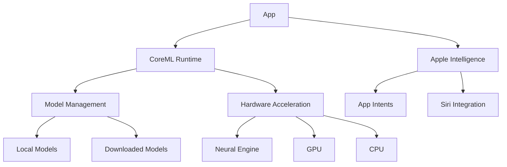

# AI Integration Guide for Apple Platforms

> A comprehensive guide for integrating AI capabilities using CoreML, Vision, Natural Language, and other frameworks across Apple platforms. Modern Apple devices feature specialized Neural Engine hardware that accelerates on-device machine learning.

## Table of Contents
- [Architecture Overview](#architecture-overview)
- [CoreML Integration](#coreml-integration)
- [Vision Framework](#vision-framework)
- [Natural Language Processing](#natural-language-processing)
- [Speech Recognition](#speech-recognition)
- [Other ML Frameworks](#other-ml-frameworks)
- [Performance Optimization](#performance-optimization)
- [WidgetKit AI Integration](#widgetkit-ai-integration)
- [Apple Intelligence](#apple-intelligence)
- [Privacy & Security](#privacy--security)
- [References & Resources](#references--resources)

## Architecture Overview

### Core Components
- **CoreML**: Foundation for on-device machine learning models  
- **CreateML**: Tools for training custom models  
- **Vision Framework**: Image, video, and object detection  
- **Natural Language Framework**: Text analysis and language processing  
- **Speech Framework**: Voice recognition and transcription  
- **Neural Engine**: Hardware acceleration for ML tasks  
- **Image Playground**: Generative AI capabilities
- **App Intents**: Apple Intelligence integration

### System Design


## CoreML Integration

Core ML 7 provides improved performance and new model types. You can convert models from frameworks like TensorFlow or PyTorch using coremltools.

### Advanced Model Types
```swift
enum ModelType {
    case vision(String) // Image classification, object detection
    case text(String)   // NLP, text classification
    case audio(String)  // Sound classification
    case recommender(String)
    case tabular(MLDataTable)
    case transformer(String)
    case generative(String) // Image Playground models
} 

struct AdaptiveModelLoader {
    static func load(_ type: ModelType) async throws -> MLModel {
        switch type {
        case .vision(let id):
            return try await CoreMLVisionIntegrator.loadVisionModel(id)
        case .text(let id):
            return try await CoreMLNLPIntegrator.loadTextModel(id)
        case .transformer(let id):
            return try await _loadTransformerModel(id)
        case .generative(let id):
            return try await ImagePlayground.loadModel(id)
        // Handle other cases
        }
    }
}
```

### Model Management
```swift
import CoreML

class ModelManager {
    static let shared = ModelManager()
    
    func loadModel() async throws -> MLModel {
        let config = MLModelConfiguration()
        config.computeUnits = .all
        
        return try await MyCustomModel(configuration: config).model
    }
    
    func updateModel() async throws {
        let defaults = MLModelDownloadOptions()
        defaults.allowLowPriorityDownload = true
        
        let task = try await MLModelDownloadTask(
            modelIdentifier: "MyModel",
            options: defaults
        )
        
        let result = try await task.resume()
        // Handle updated model
    }
}
```

### On-Device Training
```swift
struct OnDeviceTrainer {
    private let trainingData: MLBatchProvider
    private let baseModel: MLModel
    
    init(data: MLBatchProvider, model: MLModel) {
        self.trainingData = data
        self.baseModel = model
    }
    
    func incrementalTrain() async throws -> MLModel {
        let config = MLModelConfiguration()
        config.computeUnits = .cpuAndNeuralEngine
        
        let updateTask = try MLUpdateTask(
            forModelAt: baseModel.url,
            trainingData: trainingData,
            configuration: config,
            completionHandler: { context in
                // Handle updated model
            }
        )
        
        updateTask.resume()
        return try await updateTask.futureModel
    }
}
```

## Vision Framework

The Vision framework provides on-device capabilities for image classification, object detection, text recognition, and more. See [developer.apple.com](https://developer.apple.com/documentation/vision) for detailed docs.

### Image Analysis
```swift
import Vision

class ImageAnalyzer {
    func analyzeImage(_ image: CGImage) async throws -> [VNClassificationObservation] {
        let request = VNClassifyImageRequest()
        let handler = VNImageRequestHandler(cgImage: image)
        
        try await handler.perform([request])
        return request.results ?? []
    }
    
    func detectObjects(_ image: CGImage) async throws -> [VNRecognizedObjectObservation] {
        let request = VNDetectObjectsRequest()
        let handler = VNImageRequestHandler(cgImage: image)
        
        try await handler.perform([request])
        return request.results ?? []
    }
}
```

### ARKit Integration
```swift
import ARKit
import RealityKit

struct ARMLIntegrator {
    func anchorAIModels(world: ARWorldTrackingConfiguration) {
        let modelAnchors = world.detectionImages.compactMap { image in
            ARImageAnchor(name: "AI_Anchor", image: image)
        }
        
        world.detectionImages = modelAnchors
    }
    
    func processARKitData(_ frame: ARFrame) async -> MLFeatureProvider {
        let pixelBuffer = frame.capturedImage
        let depthMap = frame.sceneDepth?.depthMap
        let pose = frame.camera.transform
        
        return try await VisionFeatureExtractor.extract(
            image: pixelBuffer,
            depthData: depthMap,
            pose: pose
        )
    }

    func processVisionOSData(_ frame: ARFrame) async -> MLFeatureProvider {
        let spatialData = frame.spatialAnchors // VisionOS-specific spatial data
        let depthMap = frame.sceneDepth?.depthMap
        return try await VisionFeatureExtractor.extract(
            spatialData: spatialData,
            depthData: depthMap
        )
    }
}
```

## Natural Language Processing

Apple's [Natural Language framework](https://developer.apple.com/documentation/naturallanguage) offers text tokenization, language detection, sentiment analysis, and more.

### Text Analysis
```swift
import NaturalLanguage

class TextAnalyzer {
    private let tagger: NLTagger
    
    init() {
        tagger = NLTagger(tagSchemes: [.tokenType, .language, .lexicalClass])
    }
    
    func analyzeText(_ text: String) {
        tagger.string = text
        
        tagger.enumerateTags(in: text.startIndex..<text.endIndex,
                            unit: .word,
                            scheme: .lexicalClass) { tag, range in
            if let tag = tag {
                print("\(text[range]): \(tag.rawValue)")
            }
            return true
        }
    }
    
    func detectLanguage(_ text: String) -> String? {
        let recognizer = NLLanguageRecognizer()
        recognizer.processString(text)
        return recognizer.dominantLanguage?.rawValue
    }
}
```

## Speech Recognition

Leverage the [Speech framework](https://developer.apple.com/documentation/speech) to convert audio to text in real time, entirely on-device.

### Voice Processing
```swift
import Speech
import AVFoundation

class SpeechRecognizer: ObservableObject {
    private let recognizer = SFSpeechRecognizer(locale: Locale(identifier: "en-US"))
    private var task: SFSpeechRecognitionTask?
    
    @Published var transcript: String = ""
    
    func startRecording() throws {
        let audioSession = AVAudioSession.sharedInstance()
        try audioSession.setCategory(.record, mode: .measurement, options: .duckOthers)
        
        let recognitionRequest = SFSpeechAudioBufferRecognitionRequest()
        task = recognizer?.recognitionTask(with: recognitionRequest) { [weak self] result, error in
            guard let result = result else { return }
            self?.transcript = result.bestTranscription.formattedString
        }
    }
    
    func stopRecording() {
        task?.finish()
        task = nil
    }
}
```

## Other ML Frameworks

Beyond Core ML, Apple offers additional APIs and integrations:
- [ARKit](https://developer.apple.com/augmented-reality/) and [RealityKit](https://developer.apple.com/augmented-reality/realitykit/) for augmented reality and 3D object tracking.  
- [Metal Performance Shaders](https://developer.apple.com/metal/Metal-Performance-Shaders/) for GPU-accelerated image processing and custom ML.  
- [Vision Pro Spatial APIs](https://developer.apple.com/visionos/) for advanced object tracking, gestures, and spatial computing on visionOS devices.
- [Image Playground](https://developer.apple.com/documentation/ImagePlayground) for generative AI image creation (iOS 18.1+, macOS 15.1+).
- [App Intents](https://developer.apple.com/documentation/AppIntents) for Apple Intelligence-driven system integration.

## Performance Optimization

### Hardware Acceleration
Use the Neural Engine when available:
```swift
let config = MLModelConfiguration()
config.computeUnits = .all // Allows CPU, GPU, Neural Engine
```

### Batching & Memory
- Batch processing to reduce overhead.  
- Use background tasks for large computations.  
- Profile using Instruments (Allocations, Time Profiler) to pinpoint bottlenecks.  

## WidgetKit AI Integration

Integrate AI-driven content into widgets for real-time updates on iOS, macOS, and watchOS.

### Example Implementation
```swift
import WidgetKit
import CoreML

struct AIWidgetProvider: TimelineProvider {
    func getTimeline(in context: Context, completion: @escaping (Timeline<Entry>) -> Void) {
        Task {
            let model = try await ModelManager.shared.loadModel()
            let prediction = try model.prediction(input: MLInput())
            let entry = AIWidgetEntry(date: Date(), prediction: prediction)
            let timeline = Timeline(entries: [entry], policy: .after(.now.addingTimeInterval(3600)))
            completion(timeline)
        }
    }
}
```

## Apple Intelligence

Integrate with system-level AI features through App Intents.

### Siri Integration
```swift
import AppIntents

struct PredictIntent: AppIntent {
    static var title: LocalizedStringResource = "Make a prediction"
    
    @Parameter(title: "Input")
    var input: String
    
    func perform() async throws -> some IntentResult {
        let model = try await ModelManager.shared.loadModel()
        let prediction = try model.prediction(input: MLInput(text: input))
        return .result(value: prediction.output)
    }
}
```

## Privacy & Security

### Data Protection
- On-device inference with Core ML minimizes data exposure.  
- Use [Secure Enclave](https://developer.apple.com/documentation/security/certificate_key_and_trust_services/) for sensitive operations when needed.  
- Encrypt downloaded model files if they contain sensitive data.

### User Consent
- Always request appropriate permissions for camera, microphone, or motion usage.  
- Follow [App Privacy details on the App Store](https://developer.apple.com/app-store/app-privacy-details/).

## References & Resources

- [Core ML Documentation](https://developer.apple.com/documentation/coreml)  
- [Vision Framework Guide](https://developer.apple.com/documentation/vision)  
- [Natural Language Documentation](https://developer.apple.com/documentation/naturallanguage)  
- [Create ML Documentation](https://developer.apple.com/documentation/createml)  
- [Speech Framework](https://developer.apple.com/documentation/speech)  
- [Metal Performance Shaders](https://developer.apple.com/metal/Metal-Performance-Shaders/)  
- [RealityKit](https://developer.apple.com/documentation/realitykit)  
- [ARKit](https://developer.apple.com/augmented-reality/)  
- [Image Playground](https://developer.apple.com/documentation/ImagePlayground)  
- [App Intents](https://developer.apple.com/documentation/AppIntents)  

Note: Keep this document updated with the latest versions and best practices. Always check the official Apple documentation for the most recent changes. 